# Software Design Description — DeptTS

**Department Management Tool Suite for a university academic department**

Organised according to IEEE 1016-2009, *Standard for Information Technology — Systems Design —
Software Design Descriptions*: identified design stakeholders and their concerns, then a set of
design viewpoints, each presenting design elements (entities, attributes, relationships and
constraints) that address those concerns.

This document describes the design as built. The repository state it describes is commit `c2fc45f`
(phases P0–P13 merged). Design that
is intended but not yet implemented is marked and attributed to its phase.

---

## Table of contents

1. [Introduction](#1-introduction)
2. [Context viewpoint](#2-context-viewpoint)
3. [Composition viewpoint](#3-composition-viewpoint)
4. [Logical viewpoint](#4-logical-viewpoint)
5. [Dependency viewpoint](#5-dependency-viewpoint)
6. [Information viewpoint](#6-information-viewpoint)
7. [Interface viewpoint](#7-interface-viewpoint)
8. [Interaction viewpoint](#8-interaction-viewpoint)
9. [State dynamics viewpoint](#9-state-dynamics-viewpoint)
10. [Resource viewpoint](#10-resource-viewpoint)
11. [Design rationale](#11-design-rationale)
12. [Verification design](#12-verification-design)

---

## 1. Introduction

### 1.1 Purpose

This description explains how DeptTS is built and why it is built that way, at a level of detail
sufficient for an engineer to change it safely and for an assessor to judge it. It complements
`docs/SRS.md`, which states what the system must do.

### 1.2 Scope

The design covers one Next.js application (`src/`), one background worker (`apps/worker/`), one
PostgreSQL database (`prisma/`) and the Docker topology that runs them. It covers 91 Prisma models,
20 platform kernels, 8 modules, 23 job queues and the compiler that turns an authored process
document into the artefacts the kernels run.

### 1.3 Context

DeptTS is a self-contained web application for the departments of one faculty. It has no
synchronous integration with any other system; data arrives as spreadsheets through a staged import
pipeline and leaves as reports or as tabular exports rendered through a versioned specification.

### 1.4 Design stakeholders and their concerns

| Stakeholder | Concerns |
| --- | --- |
| Department head and deputy | That one page answers "what is active, what is overdue, who has submitted"; that approvals cannot be bypassed; that a number they reported cannot change afterwards. |
| System administrator | That a new process can be added by filling in a form rather than by commissioning code; that a release cannot silently break a process they have customised; that a mistake is recoverable (simulate before publish, migrate rather than mutate). |
| Instructor, committee member, chair, representative, lab staff | That they see their own work and nothing they should not; that acknowledging and declining work is one mechanism wherever the work came from. |
| Department administrator of data | That a spreadsheet is checked before it is written, that a bad row is fixable, and that either the whole file lands or none of it does. |
| Engineer maintaining the system | That layering is enforced rather than hoped for; that a lifecycle exists in exactly one place; that every claim about the system is checked by a test. |
| Assessor | That tenant isolation, auditability and anonymity are enforced by the database rather than asserted by the application, and that each is demonstrated by a named test. |
| Operator | That the whole stack starts from one compose file; that jobs are idempotent and observable; that a rebuild costs time and never correctness. |

### 1.5 Viewpoint map

| Viewpoint | Clause | Addresses |
| --- | --- | --- |
| Context | 2 | System boundary, actors, external systems |
| Composition | 3 | Layering, enforced boundaries, what a module is |
| Logical | 4 | The domain model by area |
| Dependency | 5 | Extensibility through registries; the singleton pattern |
| Information | 6 | Persistence, tenancy, RLS generation, immutability, specialised indexes, JSON discipline |
| Interface | 7 | Internal service contracts, the action boundary, routes, the job contract, storage |
| Interaction | 8 | The journeys that matter, as sequences |
| State dynamics | 9 | The seeded state machines, parallel groups, revision loops |
| Resource | 10 | Docker topology, queues, crons, pooling, concurrency |
| Design rationale | 11 | Decisions taken and alternatives rejected |
| Verification design | 12 | Test projects, journeys, tenancy proofs, coverage gates |

---

## 2. Context viewpoint

### 2.1 System boundary

The boundary encloses the web application, the worker, the application database schema and the
upload volume. Outside it are the browsers, the SMTP relay and (in development) Mailpit. The `pgboss`
schema is inside the same PostgreSQL instance but outside the Prisma-managed schema: it is owned and
migrated by the runtime role and Prisma migrations never touch it.

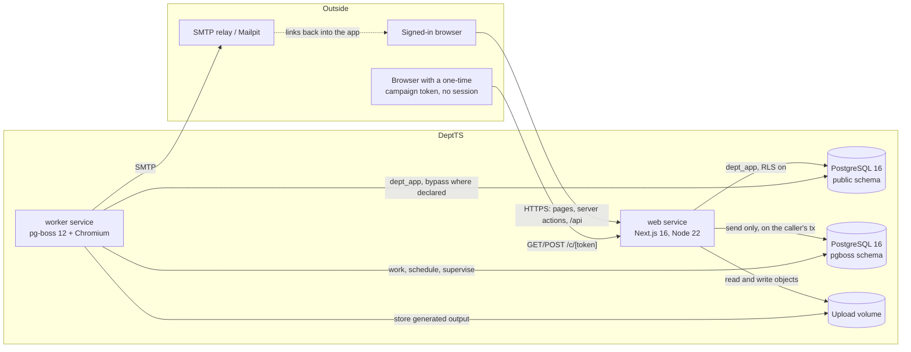

### 2.2 Actors

Nine human roles (clause 2.3 of the SRS) plus two non-human actors: the **worker**, which acts as
itself for crons and as the record's own process for automatic transitions, and the **seed**, which
acts as the other author of the system feature definitions.

### 2.3 External interfaces at the boundary

| Interface | Direction | Design note |
| --- | --- | --- |
| HTTP pages and server actions | in | One shell, two route groups behind a session, one public token route. |
| `POST /api/uploads` | in | The only way bytes enter, because server actions cap bodies at 1 MB. |
| `GET /api/documents/[id]/v/[n]/download` | out | Five-minute signed link bound to the issuing user; audited. |
| `GET /api/health` | in | Unauthenticated; the container health check. |
| SMTP | out | Worker only. The web process never sends mail synchronously. |
| Spreadsheets | in | Through the staged pipeline, never written directly. |
| `ExportFormatSpec` renderings | out | A versioned column mapping with a golden sample to diff against (consumer deferred to P25). |

---

## 3. Composition viewpoint

### 3.1 Layers

| Layer | Path | Rule |
| --- | --- | --- |
| Kernels | `src/platform/<service>/` | Framework-free. 20 services, 24 119 lines. May import each other and `src/lib`. May not import Next, React, `server-only`, `src/modules`, `src/app` or `src/components`. |
| Modules | `src/modules/<module>/` | Thin. 8 modules. May import their own files, `src/platform`, `src/lib` and `src/components` — and nothing from a sibling module. |
| Presentation | `src/app/`, `src/features/runtime/`, `src/components/` | Routes, server actions, the generic runtime UI and the component library. |
| Shared infrastructure | `src/lib/` | Auth, database clients and tenancy helpers, storage, mail, action wrappers, the `globalSingleton` helper, time and id utilities, navigation. |
| Worker | `apps/worker/` | Second entry point of the same npm package. One handler file per queue. May import neither Next nor React. |
| Data | `prisma/` | Multi-file schema, migrations, the RLS generator and manifest, the seed. |

### 3.2 Enforced boundaries

`eslint.config.mjs` implements the rule with `no-restricted-imports`, per file group:

- `src/platform/**` — forbidden paths `next`, `next/navigation`, `next/headers`, `next/server`,
  `next/cache`, `react`, `server-only`; forbidden patterns `@/modules/*`, `**/modules/**`,
  `@/app/**`, `@/components/**`.
- `src/modules/**` — forbidden pattern `../*/**`, `@/modules/*/*`, so a module cannot reach into a
  sibling.
- `apps/worker/**` — forbidden paths `next`, `react`.

The direction is therefore one-way by construction: modules compose kernels, kernels never know
about modules. Where a kernel needs something only a module can supply, it exposes a registry and
the module registers into it (clause 5).

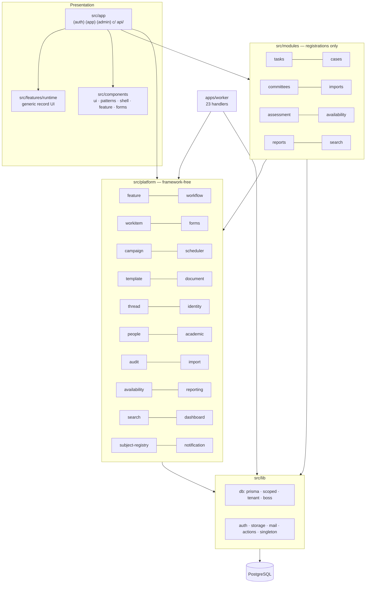

### 3.3 What a module consists of

A module is a set of registrations, never a new mechanism. Adding one means: schema part and
migration with generated RLS; SubjectRegistry registrations; a seeded feature definition with its
presets; adapters (guards, effects, hooks, backings, bindings) registered through
`src/modules/register.ts` so they land in the AdapterRegistry *and* in the engine that calls them;
React surfaces registered by the record page; reports, projections, widgets and search sources;
templates, reminder schedules, permission keys, queues with handlers, import kinds; a rewrite in
`next.config.ts` if the feature deserves a readable URL; and tests at every layer.

The committees module is the reference: `adapters.ts`, `registry.ts`, `reports.ts`, `search.ts`,
`surface.tsx`, `queries.ts`, `actions.ts` and four components — no page of its own, because the
committee and its reports are the generic runtime's pages reached through a rewrite.

### 3.4 Two registration entry points

`registerModules()` (`src/modules/index.ts`) is called by `src/lib/bootstrap.ts` in the web process
and by the worker entry point, so both carry the same registry: a definition that names an adapter
must find it wherever the transition happens to be applied. `registerRecordSurfaces()`
(`src/modules/record-surfaces.ts`) is called by the record page instead, because a surface is React:
the seed and the worker load the module registry outside Next, where a `"use server"` module refuses
to load, and a client component reached through a runtime `import()` never enters Next's client
manifest.

---

## 4. Logical viewpoint

91 models across 30 schema files. The clusters below are the ones a reader must understand; the rest
follow the same conventions.

### 4.1 Identity and tenancy

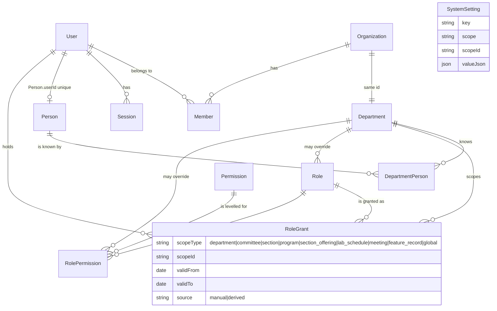

Design elements and constraints:

- `Department.id = Organization.id` and `Organization.slug` = the lower-case department code = the
  `[dept]` URL segment. There is therefore no mapping table and no ambiguity about which department
  a URL means.
- `Person` is **global** and joins a department only through `DepartmentPerson`, so one human being
  is one row faculty-wide. `Person.userId` unique is the only link to a login.
- `Role` and `RolePermission` are **shared**: a row with `departmentId = NULL` is the faculty
  default and a departmental row with the same key overrides it. A partial unique index
  (`role_key_global`) keeps faculty keys unique, because `NULL`s are distinct in a composite unique.
- `committee_chair` exists only as a `RoleGrant` scope, never as a `Member.role`.

### 4.2 People, academic registry and calendar

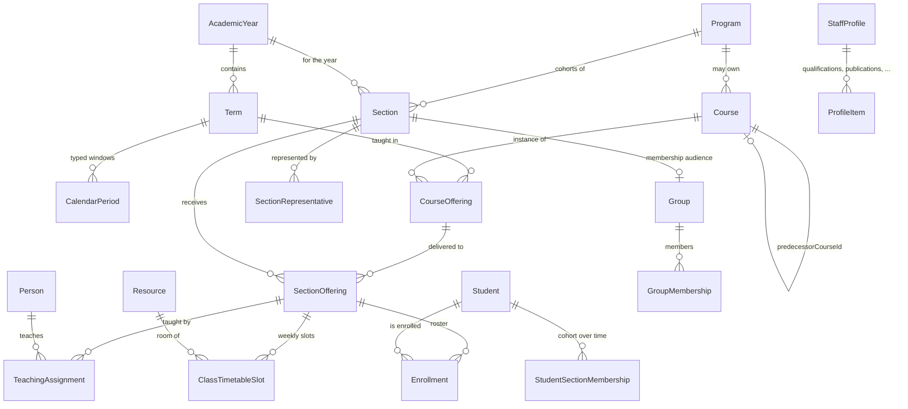

- `AcademicYear.quarterBoundariesJson` holds exactly four contiguous quarters, validated by
  `validateQuarters`. `quarterOf(date, boundaries)` is the only mapping from a date to a quarter.
  Dates are Gregorian; there is no conversion layer.
- `CalendarPeriod` is typed (`PeriodKind`) and is what deadlines anchor to through
  `resolveAnchor({periodKind, edge, offsetDays})`. A period may start up to 60 days before its
  academic year, because registration and preference windows precede their term.
- `Group` is the one membership abstraction. Committees, sections, panels and snapshotted audiences
  are all groups, which is why a committee needs no membership table of its own.
- Time-varying facts (`StudentSectionMembership`, `SectionRepresentative`, `TeachingAssignment`,
  `GroupMembership`, `RoleGrant`) carry `validFrom`/`validTo` rather than being overwritten, so
  history survives progression.

### 4.3 The feature aggregate

This is the centre of the design: `FeatureDefinition` → version → record → step instance, with the
workflow instance beside the record.

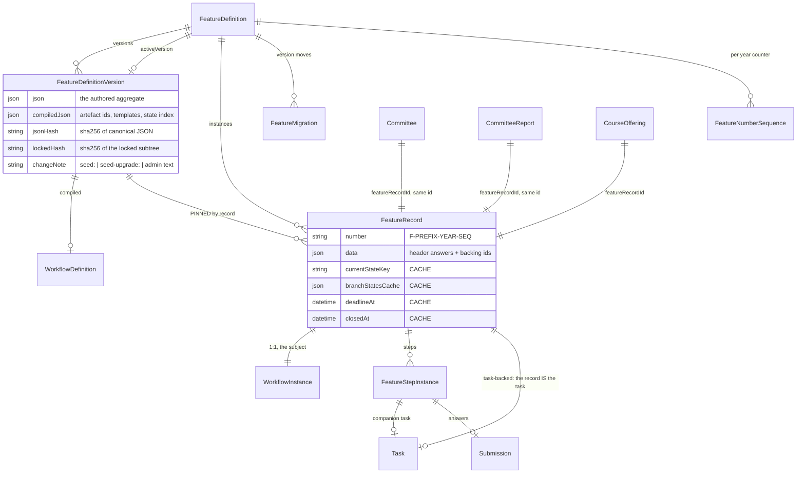

Constraints that hold the aggregate together:

- **The `FeatureRecord` is always the workflow subject.** Module rows carry `featureRecordId` unique
  and never a workflow instance of their own. `Committee` and `CommitteeReport` go further: their
  primary key *is* the record's id, so one identifier serves as link, parent reference, permission
  scope and report parameter, and `SubjectRegistry.url` can stay the synchronous function its
  contract promises.
- **Three backings.** `feature_record` (the default), `task` (the record *is* the Task row: `task`,
  `case`, and later `student_issue` and `planned_activity`), and `module` (a backing adapter writes
  the module row).
- **Every derived column is a cache.** `currentStateKey`, `branchStatesCache`, `deadlineAt` and
  `closedAt` are written only by the compiled `feature.enterStep`, `feature.exitStep` and
  `feature.setTerminal` effects.
- **`@@unique([recordId, stepKey, branchKey, sequence])`** on the step instance is what makes a
  revision loop representable: re-entering a step increments `sequence` and keeps the earlier entry
  with its answers.
- **A GIN index with `JsonbPathOps`** on `FeatureRecord.data` serves the containment queries list
  views and counters make over authored fields.

### 4.4 Workflow

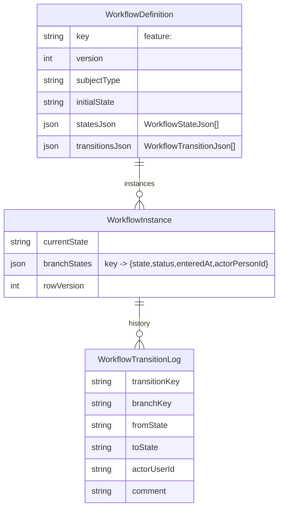

A state is `{key, label, category, slaHours?, terminalCategory?, compound?}`; a compound state adds
`{branches: BranchSpec[], completion, dynamic, onComplete, onReject?}` and a `BranchSpec` is
`{key, label, initialState, states[], doneState, rejectedState}`. A transition is
`{key, from, to, action, branch?, system, requiredPermission?, actorRules[], requiredComment,
requiredFields[], requiredAttachments[], guards[], effects[]}` with exactly **one** source — a
multi-source action compiles to one transition per source. Both schemas are `.strict()`, so there is
no `joinPolicy`, no `parallel.join` and no `from: string[]` anywhere.

Nineteen effect kinds exist: `notify`, `emit`, `createTask`, `setField`, `invokeHandler`,
`registerBlocks`, `removeBlocks`, `subscribeReminders`, `cancelReminders`, `cancelScheduled`,
`scheduleAutoTransition`, `generateDocument`, `enterStep`, `exitStep`, `enterParallel`,
`completeBranch`, `rejectBranch`, `setTerminal`, `feature`.

### 4.5 Forms, submissions and campaigns

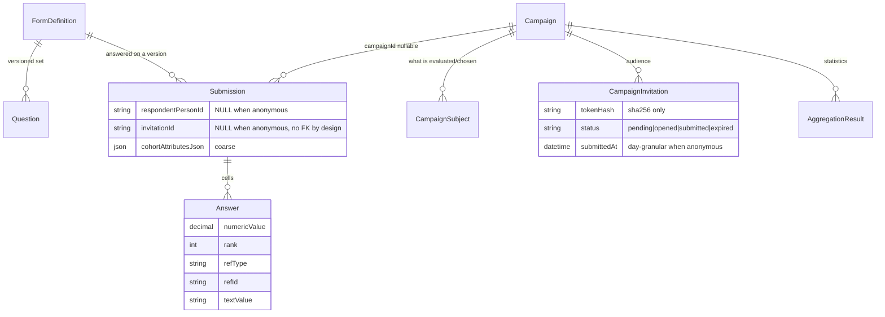

- **`Submission.campaignId` is nullable**, which is what lets a committee report, a feature step and
  (later) a portfolio narrative reuse the same question and answer machinery as a questionnaire.
- **`Submission.invitationId` has no foreign key to `CampaignInvitation`** by design: there must be
  no join path an adversary could walk. For an anonymous campaign both `respondentPersonId` and
  `invitationId` are refused outright by trigger.
- **Answers are normalised into typed columns**, so aggregation and search never parse JSON.
- 25 question types and 11 source bindings (plus `none`) are enumerated in
  `src/platform/forms/field-schema.ts`, which the feature builder reuses rather than declaring its
  own field contract; it adds only `readOnly`, `visibleTo` and `recordPicker`, which describe who
  sees a field rather than what a valid answer is, and therefore never reach a `Question` row or the
  question hash.

### 4.6 Assessment (P13)

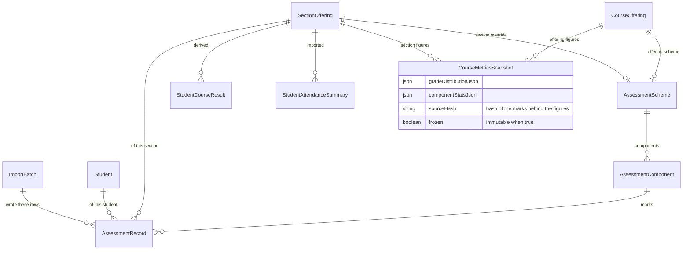

Marks are stored as imported (`isMissing` distinguishes an empty cell from a zero); results and
figures are derived and recomputable; a snapshot the department has reported on is frozen and the
database refuses to change it. `AssessmentComponent.offeringComponentId` maps a section override
onto the offering component it stands for, and `excludedFromConsolidation` keeps a make-up test out
of the course-level figures.

---

## 5. Dependency viewpoint

### 5.1 The registries

Extensibility is not achieved by inheritance or by plugins on disk; it is achieved by registries a
kernel owns and a module fills. Every one of them is a `Map` behind `globalSingleton`.

| Registry | Owner | What it holds | Filled by |
| --- | --- | --- | --- |
| SubjectRegistry | `src/platform/subject-registry/` | Per subject type: `label`, `snapshot`, `contextOf`, `relationships`, `variables?`, `indexDoc?`, `url?`, `onChanged?`, `onDeleted?` | Every owning kernel (`people`, `academic`, `document`, `thread`, `workitem`, `forms`, `campaign`, `feature`, `availability`, `import`, `reporting`) and the committees module |
| AdapterRegistry | `src/platform/feature/adapters/registry.ts` | `{key, module, hook, description, simulable, run}` for guards, effects, `on_enter`/`on_exit`, `compute`, `validate`, `backing`, `relationship`, `projection` | `src/modules/register.ts` helpers; mirrored into `adapter_registration` |
| Guard registry | `src/platform/workflow/guards.ts` | Named guards the engine calls | Kernels and modules |
| Effect handler registry | `src/platform/workflow/effects.ts` | Named handlers per effect kind or adapter key | Kernels and modules |
| Recipient rules | `src/platform/scheduler/` | Named audiences a `notify` effect may address (`task_assignees`, `task_creator`, …) | The owning service |
| Import validators / committers | `src/platform/import/validators/registry.ts`, `committers/registry.ts` | One of each per import kind | `installImportKinds()` (roster, class timetable) and the assessment module (marks, attendance, students) |
| Import kind specs | `src/platform/import/templates.ts` | Column lists, context subject type, context-dependent columns | Platform for its two kinds, modules for theirs |
| Source bindings | `src/platform/forms/bindings.ts` | Resolvers for the 11 dynamic option sources | `installBindings()` and modules |
| Report registry | `src/platform/reporting/registry.ts` | `{key, title, requiredPermission, formats, parameters, parameterFields, dataSource, templateKey?}` | `installSystemReports()` (3) and the committees module (2) |
| Projection registry | `src/platform/dashboard/projections/registry.ts` | `{key, events[], apply, rebuild}` | `installBuiltInProjections()` (3); modules later |
| Widget registry / layouts | `src/platform/dashboard/widgets.ts`, `layouts.ts` | `{key, permission?, build}` and role → widget order | `installBuiltInWidgets()` (7 widgets, 4 layouts) |
| Search permission fallbacks | `src/platform/search/permissions.ts` | `<type>.view` → a real permission key | `installSearchPermissions()` |
| Outbox subscribers | `src/platform/audit/outbox.ts` | `(eventName, handlerKey, handler)` | `installGrantSubscribers`, scheduler, thread, campaign, search, dashboard, assessment |
| Surfaces | `src/modules/surfaces.ts` | `{featureKey, recordExtras}` React contributions | `registerRecordSurfaces()` from the record page |
| Retention providers | `src/platform/document/retention.ts` | What the weekly job may purge | `registerDocumentRetention()` |
| Queue catalogue | `src/platform/scheduler/queues.ts` | 23 queue specs with policy, retries, expiry, dead letter and cron | A phase appends; never created ad hoc |

Dependency inversion follows from this: the scheduler does not know what a task is, so the work-item
service registers the recipient rules that name task assignees; the reporting framework does not
know what a committee is, so the committees module registers a data source.

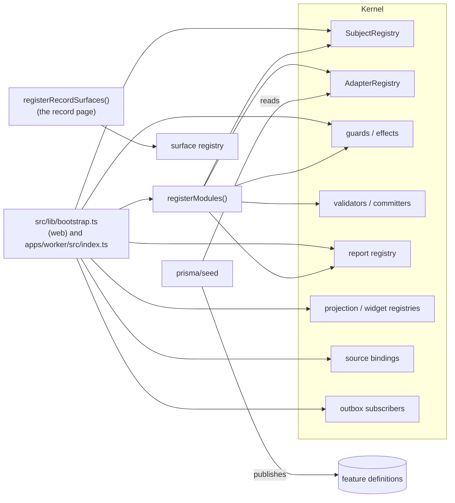

### 5.2 `globalSingleton` and why it exists

```ts
export function globalSingleton<T>(key: string, init: () => T): T {
  const g = globalThis as unknown as Record<string, T | undefined>;
  const k = `__deptts_${key}`;
  if (g[k] === undefined) g[k] = init();
  return g[k] as T;
}
```

Next.js may instantiate a shared module more than once — once per route chunk, again on hot reload —
so a module-level `Map` is not process-wide. Three concrete failures forced this design and are
recorded in `docs/design/DEVIATIONS.md`: the audit interceptor's actor arrived as `system` in the
production build because the interceptor's chunk held a different `AsyncLocalStorage` from the one
the action wrapper wrote to (P4); the P4 no-op effect recorders silently replaced the real `notify`
handler and the `setField` allow-list lost its task entry, because a second copy of
`workflow/effects.ts` ran its module-scope registrations (P7); the dashboard rendered empty because
the widget registrations went to the other copy of `widgets.ts` (P11c). Registries, caches and the
audit `AsyncLocalStorage` therefore all live on `globalThis`, and the effect recorders now register
only for kinds that have no handler.

### 5.3 External dependency policy

Versions are pinned exactly (`.npmrc` `save-exact=true`). Three pins are load-bearing:
`prisma`/`@prisma/client`/`@prisma/adapter-pg` at 7.10.0 (npm `latest` for the CLI is an 8.0 release
candidate with a different configuration shape and query API); `exceljs-hardened@5.0.0` instead of
upstream `exceljs`, which has an unfixed critical prototype-pollution advisory; `eslint@9.39.5`
rather than 10, because `eslint-config-next@16.3.5` bundles a React plugin that still calls
`context.getFilename`, which ESLint 10 removed.

---

## 6. Information viewpoint

### 6.1 Multi-file schema and conventions

`prisma/schema/` holds 30 files: `schema.prisma` (generator `prisma-client`, output
`../../src/generated/prisma`, `moduleFormat esm`), `enums.prisma` (91 enums in one file, including
the merged `SubjectType`), `auth.prisma` (generated by `npx auth@latest generate`, with only
snake-case maps and two back-relations hand-applied), one file per kernel service, one per module,
and five empty placeholders reserved for P17–P25.

Conventions, all machine-checked by `prisma/scripts/check-schema.ts`:

- Text `cuid()` identifiers everywhere, because better-auth identifiers are text.
- Every model and column carries a snake_case `@@map`/`@map`.
- Every `Json` column has a Zod schema registered under `"<Model>.<field>"` in
  `src/lib/db/json-schemas.ts` — 65 entries today — and the check fails when one is missing.
- `rowVersion` on rows that are edited, for optimistic concurrency.
- A polymorphic reference is a `SubjectType` column plus a text id plus an index, with no foreign
  key, and the row still carries `departmentId`.

### 6.2 Tenancy classification and generated RLS

`prisma/scripts/gen-rls.ts` reads the Prisma DMMF (using `dbName`, so the SQL uses the real
snake_case names) and classifies every model by its `departmentId` field:

| Class | Rule | Policy |
| --- | --- | --- |
| **tenant** (61) | `departmentId` required | `USING`/`WITH CHECK`: `department_id = current_setting('app.current_department_id', true) OR current_setting('app.tenant_bypass', true) = 'on'` |
| **shared** (12) | `departmentId` nullable | `USING` also admits `department_id IS NULL`; `WITH CHECK` admits a NULL row only under bypass |
| **global** (18) | no `departmentId` | no policy |

Each policied table gets `ENABLE ROW LEVEL SECURITY`, `FORCE ROW LEVEL SECURITY` and a policy named
`tenant_isolation`. The generator has three modes:

- no flag — refresh `prisma/rls-manifest.json` and print the SQL for tables not yet covered;
- `--append <migration.sql>` — append the policies for uncovered tables to a migration and refresh
  the manifest (it reads every existing migration to learn what is already covered);
- `--check` — exit non-zero when the manifest is stale or a tenant table has no policy.

The manifest carries a sha256 over the sorted table names per class
(`ffeecc9175aa6976cc09658d39a39252e04089d3d1ed3dec3bb17219bff1baf5` today), and every appended block
of SQL records the hash it was generated against. `npm run rls:check` is part of `npm run check` and
of every phase's verification, and `tests/integration/tenancy/rls-coverage.test.ts` re-proves
coverage against the live database in every later phase. Coverage therefore cannot drift as tables
are added: a new tenant table without a policy fails the build.

### 6.3 Setting the context: `withTenantTx`, `withTenantBypass`, `forDepartment`

Three access paths, in order of preference:

1. **`withTenantTx(departmentId, fn)`** — one Prisma interactive transaction whose first statement is
   `SELECT set_config('app.current_department_id', $1, true)`. Everything inside, including nested
   writes and raw SQL, is filtered by RLS. The callback runs inside `runWithAudit({tx, departmentId})`,
   and is awaited inside that scope so lazily executed Prisma promises keep the context.
2. **`getDb(departmentId)` / `forDepartment(id)`** — a request-cached query extension that injects
   `departmentId` into `create`, `createMany` and `upsert` data for tenant and shared models,
   rejects a foreign one with `TenantMismatchError`, and wraps each operation — **including raw
   queries** — in a transaction that sets the department. It is a safety net and a convenience; RLS is
   the boundary.
3. **`withTenantBypass(actor, reason, fn)`** — `SELECT set_config('app.tenant_bypass', 'on', true)`
   for faculty-wide work: administrator pages over shared tables, `grant.reconcile`,
   `retention.run`, the outbox dispatcher, resolving the department of a campaign token, and the
   seeds. Every use writes an `AuditEvent` with action `tenant_bypass` whose reason names
   `user:<id>` or `job:<name>`, through the auditor installed by `bootstrap()`.

### 6.4 Immutability enforced by the database

| Table | Mechanism |
| --- | --- |
| `audit_event`, `workflow_transition_log`, `event_handler_receipt` | `REVOKE UPDATE, DELETE … FROM dept_app` plus a `raise_immutable()` `BEFORE UPDATE OR DELETE` trigger that raises `insufficient_privilege`. |
| `domain_event` | `UPDATE`/`DELETE` revoked, then `GRANT UPDATE (published_at, dead_at, attempts, last_error)` and `GRANT DELETE`; the `domain_event_guard` trigger refuses a change to any identity or payload column and refuses deletion of an unpublished row. |
| `document_version` | `UPDATE`/`DELETE` revoked, then `GRANT UPDATE (locked_at, locked_by_transition_log_id, extracted_text)`; the `document_version_immutable` trigger refuses every update once `locked_at` is set. |
| `course_metrics_snapshot` | `course_metrics_snapshot_frozen` trigger fires `raise_immutable()` for any update `WHEN (OLD.frozen)`. |
| `submission`, `campaign_invitation` | `enforce_submission_anonymity()` and `enforce_invitation_anonymity()` refuse a respondent or invitation on an anonymous submission and refuse a timestamp that is not `date_trunc('day', …)`; `submission_one_per_invitation` is a partial unique index enforcing the `single` submission rule. |

Two `SECURITY DEFINER` functions exist because the definer must bypass those column revokes:
`document_version_lock(document, version, transitionLog)` repeats the tenant check itself
(`app.current_department_id` or bypass) and refuses an already-locked version;
`document_version_purge(document)` requires bypass and deletes only unlocked versions. Neither sets
a fixed `search_path`, because a fixed search path would point a per-run test schema at `public`.
`purge_domain_events(before)` is for the same reason a plain function executed under bypass.

Faculty-level rows are the one exception RLS would otherwise block: permissive `faculty_insert`
policies on `audit_event` and `domain_event` allow inserting a row with `department_id IS NULL`
without bypass, so administrator pages and provisioning are still audited.

### 6.5 Generated columns and specialised indexes

| Object | Purpose |
| --- | --- |
| `search_index_entry.search tsvector GENERATED ALWAYS AS (setweight(to_tsvector('simple', title),'A') \|\| setweight(to_tsvector('simple', body_text),'B')) STORED`, with a GIN index | PostgreSQL maintains the searchable text, so no writer can forget it. `simple` rather than `english`: the corpus is Amharic and English names, codes and titles, where stemming does more harm than good. |
| `search_index_entry.acl_tokens` GIN | The first search gate is an array overlap. |
| `person_full_name_trgm`, `course_title_trgm`, `document_title_trgm`, `search_index_entry_title_trgm` (GIN, `public.gin_trgm_ops`) | Fuzzy names and prefix suggestions. The operator class is schema-qualified because each test run migrates into a schema of its own, where an extension installed locally would be invisible. |
| `document_version_text_gin` on `to_tsvector('simple', extracted_text)` | Finding a phrase inside an uploaded file. |
| `availability_block … EXCLUDE USING gist (owner_type WITH =, owner_id WITH =, tsrange(start_at, end_at) WITH &&) WHERE (severity = 'hard' AND weekday IS NULL)` | Makes a double booking unrepresentable. `btree_gist` supplies the equality operators; `tsrange` rather than `tstzrange` because Prisma stores `DateTime` as `timestamp(3)` and a zone-dependent expression may not be indexed. |
| `feature_record.data` GIN with `JsonbPathOps` | Containment queries from list views and counters. |
| `role_key_global`, `feature_definition_key_global`, `section_rep_primary`, `submission_one_per_invitation`, `duty_active_person` (P21) | Partial unique indexes, because `NULL`s are distinct in a composite unique. |
| `task_open_due_idx` on `(department_id, due_at) WHERE completed_at IS NULL` | The overdue sweep and My Work. |
| `task_backing_check` | A Task row must be a record's, a step's companion or a recurrence template. |

The search `tsvector` and the trigram indexes are **also declared in the Prisma schema**
(`Unsupported("tsvector")?` with `@default(dbgenerated())`, and `@@index([... ops: raw("gin_trgm_ops")], type: Gin)`),
because Prisma diffs against the schema and removes what the schema cannot see: an undeclared index
was dropped by a later `migrate dev` once.

### 6.6 JSON discipline

JSON is used where the shape is authored rather than queried: feature definitions and their compiled
artefacts, workflow states and transitions, reminder offsets, template channel variants, import
rows, availability windows, projection dimensions and values, record data. Every such column is
registered in `src/lib/db/json-schemas.ts` with a Zod schema and validated at the boundary before it
is written; `npm run schema:check` fails when a `Json` column has no entry. Where containment is
queried, a `JsonbPathOps` GIN index is added.

### 6.7 Roles, databases and migrations

`docker/postgres/init.sql` is the only place roles and databases are created: `dept_migrator`
(`LOGIN`, `CREATEDB`, `BYPASSRLS`, owner of every table) and `dept_app` (`LOGIN`, `NOBYPASSRLS`),
databases `dept`, `dept_test`, `dept_e2e`, the `pgboss` schema owned by `dept_app`, the `pg_trgm` and
`btree_gist` extensions, and default privileges granting `dept_app` DML on future tables. `dept_app`
also needs `CREATE` on each database, because pg-boss issues `CREATE SCHEMA IF NOT EXISTS pgboss`
and PostgreSQL checks the database privilege before the existence check.

There are 32 migrations. Twelve of them are hand-written or hand-extended: `extensions`,
`append_only`, `document_locks`, `p11_search` (generated column, GIN and trigram indexes), the
`p3_offering_index` and `p6_tenant_indexes` index sets, and the six `constraints_p*` migrations. A
new migration is made with `migrate dev --create-only`, then `gen-rls.ts --append` adds the policies,
then `migrate dev` applies it.

---

## 7. Interface viewpoint

### 7.1 Kernel service interfaces

Only the contracts a caller must understand are listed; each is exported from the service's
`index.ts`.

| Service | Interface | Contract |
| --- | --- | --- |
| identity | `can(store, actor, key, subjectRef?, opts?) → {allowed, level, reason}` | The single decision point. Framework-free: data comes from an injected `PolicyStore`, subject context from an injected `SubjectResolver`. |
| | `setSubjectResolver`, `registerPermissionFallback` | Installed once by `bootstrap()`. |
| subject-registry | `register(type, registration)`, `contextOf`, `relationships`, `label`, `snapshot`, `variables`, `indexDoc`, `url`, `resolverWith(getDb)` | Every registration method takes the caller's `Db` client first, so it reads under the caller's RLS context rather than opening its own connection. |
| workflow | `start(tx, input) → InstanceRow` | Creates the instance in the caller's transaction. |
| | `applyIn(tx, instanceId, transitionKey, actor, input) → ApplyResult` | Locks the instance `FOR UPDATE`, checks permission and actor rules, runs guards, applies effects, appends the log. Supports `expectedRowVersion` and `expectedState`. |
| | `apply(departmentId, …)` | The same in its own department transaction, for actions and jobs. |
| | `availableActions(…) → AvailableAction[]` | What this actor may do now, with `actorAllowed` reported separately from whether the action is enabled. |
| | `migrateInstance(…)` | Moves one instance to another definition version, logging a `migrate` transition. |
| feature | `validateDefinition(def, ctx) → Issue[]` | 32 codes; world-dependent rules run only when the context supplies that part. |
| | `compile(def) → CompiledFeature` | Pure. Workflow definition, forms, task templates, reminder templates, permissions, grant requirements, report. |
| | `simulate(def, script) → SimulationTrace` | Runs the compiled machine in memory; writes nothing. |
| | `allLocks(def, isSystem)`, `lockedPathsChanged`, `assertLockedPathsUnchanged`, `jsonHash`, `lockedHash` | The lock algebra over RFC 6901 pointers with `*` wildcards. |
| | `publishVersion(...)` / `publishVersionOn(tx, …) → PublishResult` | Validate, compile, write every artefact, activate, emit `feature.published` — one transaction. |
| | `seedFeature(tx, input, {autoPublish})` → `SeedOutcome` | `created \| unchanged \| upgraded \| published_upgrade`. |
| | `planMigration`, `createMigration`, `runMigrationBatch` | Diff, preview, then batches of 200. |
| feature runtime | `createRecord(…) → CreatedRecord` | Validate header, number, back, start, enter first step. |
| | `act(…)`, `saveStepDraft(…)`, `availableActions(…)` | `act` is the only path into `Workflow.apply`. |
| | `enterStep`, `exitStep`, `enterParallel`, `completeBranch`, `rejectBranch`, `setTerminal`, `refreshCaches`, `moveDeadline` | The effect implementations; nothing else writes the caches. |
| workitem | `createTask`, `createTaskRecord`, `assign`, `transition`, `setDeadline`, `acknowledgements`, `deliverableStatus`, `requestUpdate`, `isOverdue`, `myWork` | `createTask` writes only the Task row and its assignments; `createTaskRecord` creates the record that owns the lifecycle. |
| forms | `defineForm`, `newVersion`, `latestVersion`, `zodFromFields`, `submit`, `saveDraft`, `answersAsVariables`, `boundOptionsFor` | A new version only when the question hash changes. |
| campaign | `createCampaign`, `publishCampaign`, `openCampaign`, `closeCampaign`, `rescheduleCampaign`, `departmentOfToken`, `openLink`, `submitViaToken`, `participation`, `aggregate` | `departmentOfToken` reads one column under bypass; everything else runs in that department's transaction. |
| scheduler | `enqueue(tx, queue, payload, opts) → EnqueueResult`, `fromPrisma(tx)` | Sends on the caller's transaction and writes the ledger row. |
| | `notify(input) → NotifyResult`, `subscribeReminders`, `cancelReminders`, `upcoming`, `inbox` | `notify` renders the channel variants at notify time into `Notification.renderedJson`. |
| document | `upload`, `addVersion`, `link`, `unlink`, `listFor`, `get`, `downloadUrl`, `recordDownload`, `storeGenerated`, `softDelete`, `restore`, `slotStatus`, `lockVersion` | Bytes only through here. |
| availability | `registerBlocks(source, blocks)`, `removeBySource`, `checkConflicts`, `freeSlots`, `workload`, `suggestAssignees`, `definePolicy`, `materialiseRecurring`, `occurrencesOf` | `registerBlocks` replaces everything that source wrote and throws `HardConflictError` naming the collision. |
| import | `createBatch`, `parseBatch`, `storeManualRows`, `validateBatch`, `preview`, `fixRow`, `skipRow`, `commitBatch`, `summaryFor`, `kindSpec`, `templateCsv` | `commitBatch` runs the committer inside its own transaction. |
| reporting | `registerReport`, `generate`, `runGeneration`, `setPdfRenderer`, `renderRows` (export spec) | `setPdfRenderer` is the seam the worker fills with Chromium. |
| search | `index`, `remove`, `search`, `suggest`, `rebuild`, `tokensForSubject`, `tokensForActor` | Two gates: tokens then `can()`. |
| dashboard | `registerProjection`, `writeRows`, `readProjection`, `registerWidget`, `registerLayout`, `getDashboard` | A projection may recompute or patch; the registry does not care which. |
| audit | `publish(tx, event)`, `subscribe(name, handlerKey, handler)`, `dispatchPending(limit)`, `pendingCount`, `record(tx, …)`, `history` | `publish` writes in the caller's transaction. |

### 7.2 The server-action boundary

Two wrappers in `src/lib/actions/safe-action.ts` are the only way a mutation reaches a kernel from a
page:

```
safeAction(schema, handler, { permission?, verb?, subject? })
  → parse {dept} ∧ schema        (validation failure returns issues per field)
  → requireDeptContext(dept)      (session, membership, department resolution)
  → runWithAudit({ actorUserId, correlationId, departmentId })
  → requireCan(ctx, permission, subject(input), verb)   when a permission is declared
  → withTenantTx(departmentId, db => handler({ input, ctx, db }))
  → { ok: true, data } | { ok: false, code, message, issues? }
```

`adminAction(schema, handler)` is the faculty-level equivalent: it requires the global
administrator, opens no department transaction, and leaves the handler to use `prismaRoot` or
`withTenantBypass`.

Error mapping is total and deliberate: `UnauthenticatedError` → `unauthenticated`,
`ForbiddenError`/`TenantMismatchError` → `forbidden`, Prisma `P2002` → `conflict`, everything else →
`error` with the message. Next.js control-flow errors (`NEXT_REDIRECT`, `NEXT_NOT_FOUND`) are
re-thrown, never swallowed.

### 7.3 Route surface and rewrites

| Group | Routes |
| --- | --- |
| `(auth)` | `/login`, `/reset-password?token=`, `/set-password?token=`, `/select-department` |
| `(app)` | `/d/[dept]` (the dashboard itself), `/d/[dept]/f/[featureKey]{,/new,/[recordId],/[recordId]/steps/[stepKey],/[recordId]/history}`, `/d/[dept]/f/record/[recordId]`, and the `(modules)` segment: `availability`, `calendar`, `campaigns/[campaignId]/results`, `courses`, `documents`, `inbox`, `my-work`, `offerings{,/[id]}`, `people{,/[personId]}`, `programs`, `reports`, `resources`, `search`, `sections`, `settings/notifications`, `upcoming` |
| `(admin)` | `/admin`, and `audit`, `departments`, `features{,/[key],/[key]/migrate}`, `forms{,/[formId]}`, `jobs`, `permissions`, `reminders`, `settings`, `templates{,/[key]}`, `users`, `workflows{,/[key]}` |
| Public | `/c/[token]` |
| API | `/api/auth/[...all]`, `/api/uploads`, `/api/documents/[id]/v/[versionNo]/download`, `/api/health` |

`next.config.ts` rewrites eight paths so the built-ins keep readable URLs with one implementation:
`/d/:dept/tasks`, `/cases`, `/committees`, `/imports` and their sub-paths onto
`/d/:dept/f/{task,case,committee,import_batch}`. The id in those URLs is the `FeatureRecord`'s,
which is what `SubjectRegistry.url` hands out, so a notification link and a rewritten page agree.

`src/proxy.ts` (Next 16's renamed middleware, Node runtime) is optimistic only: it redirects a
visitor with no session cookie away from `/d/*`, `/admin*` and `/select-department`, and a visitor
with one away from `/login`. Its matcher excludes `api/auth`, `api/health`, `_next`, static assets
and the public `c/` and `a/` prefixes. Every layout, page, action and route handler re-checks.

### 7.4 The worker job contract

```ts
interface WorkerHandler {
  queue: string;
  batchSize?: number;                 // default 1
  pollingIntervalSeconds?: number;    // default 2
  handle(jobs: Job[], ctx: { boss: PgBoss }): Promise<void>;
}
```

One default-exported handler per file, the file named after the queue with `.` replaced by `-`, all
listed in `apps/worker/src/registry.ts`. `registerHandlers` calls `boss.work` for each.
`registerSchedules` upserts every cron from the shared catalogue in `APP_TIMEZONE` and unschedules
any cron no longer listed, so the catalogue is the single source of truth.

### 7.5 Storage provider

```ts
interface StorageProvider {
  put(source: Readable | Buffer, meta: { mimeType: string }): Promise<{ key; sizeBytes; checksum }>;
  get(key: string): Promise<Readable>;
  delete(key: string): Promise<void>;
  exists(key: string): Promise<boolean>;
}
```

Keys are generated by the provider, never derived from user input, and must match
`^\d{4}/(0[1-9]|1[0-2])/[a-f0-9]{32}$` (`assertKey`). `checksum` is the lower-case hex sha256 of the
bytes. A local-disk implementation is in use; an S3 stub exists for later.

---

## 8. Interaction viewpoint

### 8.1 Authoring and publishing a feature

```mermaid
sequenceDiagram
    actor Admin
    participant Page as /admin/features/[key]
    participant Val as validate.ts
    participant Locks as locks.ts
    participant Pub as publish.ts
    participant Comp as compile.ts
    participant DB as PostgreSQL
    participant Out as outbox

    Admin->>Page: edit the definition document
    Page->>Val: validateDefinition(def, draft context)
    Val-->>Page: Issue[] (32 codes, errors and warnings)
    Page->>Locks: assertLockedPathsUnchanged(previous, next, allLocks(def))
    Locks-->>Page: LockViolation naming each moved pointer, or nothing
    Page->>DB: save draft version N+1
    Admin->>Page: Simulate
    Page->>Comp: compile + run the machine in memory
    Comp-->>Admin: states, branches, tasks, deadlines, reminders, grants needed
    Admin->>Pub: Publish
    Pub->>DB: publishContext — taken keys, published forms, templates, schedules, roles
    Pub->>Val: validateDefinition(def, full context)
    Pub->>Comp: compile(def)
    rect rgb(238,244,252)
    note over Pub,DB: one transaction
    Pub->>DB: upsert WorkflowDefinition feature:<key>
    Pub->>DB: upsert a FormDefinition per step (new version only on a question-hash change)
    Pub->>DB: upsert Permission and RolePermission rows
    Pub->>DB: write compiledJson, publishedAt; point activeVersionId at it
    Pub->>Out: publish feature.published
    end
    Out-->>DB: nav cache bust · adapter refresh · search reindex
    note over DB: running records are untouched — each pins its own definitionVersionId
```

### 8.2 Creating a record and acting on a step

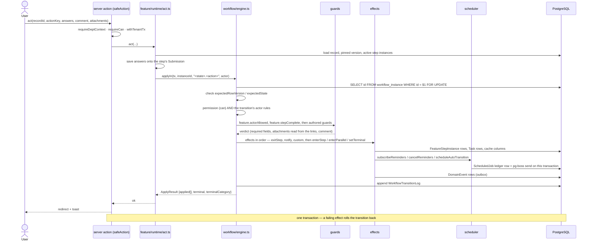

### 8.3 The transactional outbox and its dispatcher

```mermaid
sequenceDiagram
    participant Caller as any service
    participant DB as PostgreSQL
    participant Cron as pg-boss cron (every minute)
    participant Job as outbox.dispatch handler
    participant Disp as dispatchPending
    participant Subs as subscribers

    Caller->>DB: write the change AND insert domain_event (same transaction)
    Cron->>Job: seed the chain
    Job->>Disp: dispatchPending(200), up to 10 pages
    Disp->>DB: SELECT id … WHERE published_at IS NULL AND dead_at IS NULL ORDER BY occurred_at, id LIMIT n FOR UPDATE SKIP LOCKED
    loop per event, under audited tenant bypass
        Disp->>DB: re-lock the event; load its receipts
        loop per subscriber not already receipted
            Disp->>DB: SAVEPOINT
            Disp->>DB: insert EventHandlerReceipt(event, handler)
            Disp->>Subs: handler(event, tx)
            alt handler succeeded
                Disp->>DB: RELEASE SAVEPOINT
            else handler threw
                Disp->>DB: ROLLBACK TO SAVEPOINT (the receipt rolls back with it)
                Disp->>Disp: remember the first error
            end
        end
        alt every handler succeeded
            Disp->>DB: set published_at
        else
            Disp->>DB: attempts += 1, lastError; dead_at when attempts >= 10
        end
    end
    Job->>Cron: boss.send("outbox.dispatch", startAfter 5s) — self-chaining
```

Derived grants, search index maintenance, projection updates, thread notifications and campaign
follow-ups are all subscribers on this one path.

### 8.4 An import from upload to commit to snapshot recomputation

```mermaid
sequenceDiagram
    actor Staff
    participant UP as POST /api/uploads
    participant RT as feature runtime (import_batch)
    participant Pipe as import/pipeline.ts
    participant W as worker
    participant V as validator
    participant C as committer
    participant Av as availability / assessment
    participant DB as PostgreSQL

    Staff->>UP: the workbook
    UP->>UP: address and user token buckets · size cap · magic bytes · CSV parse check
    UP->>DB: Document + immutable DocumentVersion, linked to the batch record
    Staff->>RT: act "Read the file" (uploaded → parsed)
    alt sizeBytes > 1 000 000
        RT->>W: enqueue import.parse
        W->>Pipe: parseBatch(bytes)
    else
        RT->>Pipe: parseBatch(bytes) in the request
    end
    Pipe->>Pipe: match columns (case, spaces and punctuation ignored; a saved profile beats every guess)
    Pipe->>DB: ImportRow per line with rawJson
    Staff->>RT: act "Check the rows" (parsed → validated)
    RT->>V: validateRows(kind, ctx, every row at once)
    V-->>Pipe: per-row {normalized, errors, warnings}; a missing required column is one batch error
    Pipe->>DB: normalizedJson, errorsJson, warningsJson, summaryJson
    Staff->>RT: fix a row in the preview → re-check
    Staff->>RT: act "Commit" (validated → committed)
    RT->>Pipe: commitBatch
    rect rgb(238,244,252)
    note over Pipe,DB: one transaction — the whole file lands or none of it does
    Pipe->>Pipe: guards import.sectionNotLocked, import.actorMayCommit
    Pipe->>C: committer(rows a validator already understood)
    C->>DB: Enrollment / ClassTimetableSlot / AssessmentRecord …
    C->>Av: registerBlocks(source) for a timetable — replaces what that source wrote
    Pipe->>DB: mark the previous batch of this context replaced
    Pipe->>DB: DomainEvent import.committed
    end
    DB-->>W: outbox → assessment subscriber enqueues snapshot.compute (singleton per section offering)
    W->>Av: recomputeSection → StudentCourseResult + CourseMetricsSnapshot
    W->>Av: recomputeOffering (consolidated) unless frozen
```

### 8.5 Report generation through the worker's Chromium

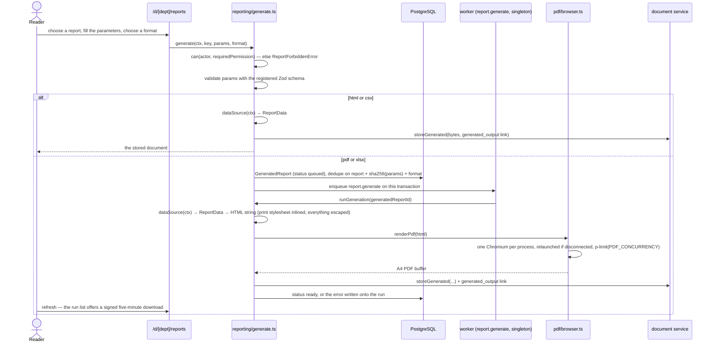

### 8.6 A search query

```mermaid
sequenceDiagram
    actor Reader
    participant Box as /d/[dept]/search or the command palette
    participant Q as search/query.ts
    participant ACL as search/acl.ts
    participant DB as PostgreSQL
    participant Can as identity/can.ts
    participant Reg as SubjectRegistry

    Reader->>Box: type a query
    Box->>Q: search(db, actor, raw)
    Q->>Q: sanitise — strip backslashes, collapse spaces, 200 characters
    Q->>ACL: tokensForActor(db, actor)
    ACL->>DB: active RoleGrants → role:<key>@dept:<id>; group memberships → group:<id>
    ACL-->>Q: [dept:…, person:…, role:…@dept:…, group:…]
    Q->>DB: WHERE search @@ websearch_to_tsquery('simple', q) AND acl_tokens && $tokens ORDER BY ts_rank
    DB-->>Q: candidate rows with ts_headline snippets
    loop per hit, unless the caller is trusted
        Q->>Can: can(actor, "<subjectType>.view", ref) — registered fallbacks make the key real
        Can->>Reg: contextOf / relationships under the actor's department client
    end
    Q->>Reg: url(subjectId, deptSlug) for each surviving hit
    Q-->>Reader: hits grouped by what they are
```

---

## 9. State dynamics viewpoint

Each diagram below is the machine the compiler produces from the seeded definition named. A state is
a leaf step or a terminal; the transition labels are the action keys an author wrote.

### 9.1 `task` — one lifecycle for every task-like thing

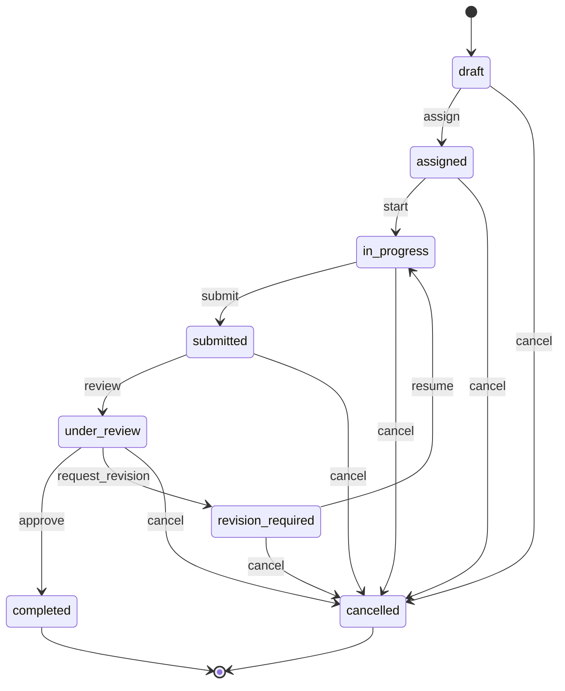

`cancel` is added to every step by one helper in the seed, requires a comment, and is open to the
creator or to anybody holding `task.manage`. Ten presets (general, committee, department, instructor,
student activity, administrative, action item, CQI action, maintenance, lab activity) share this one
machine and differ only in locked field defaults, parent type and navigation label. The `assigned`
and `revision_required` steps carry the same deadline rule as `in_progress`, because a task due on
Friday is due on Friday whoever holds it.

### 9.2 `case` — a follow-up the department owes an answer to

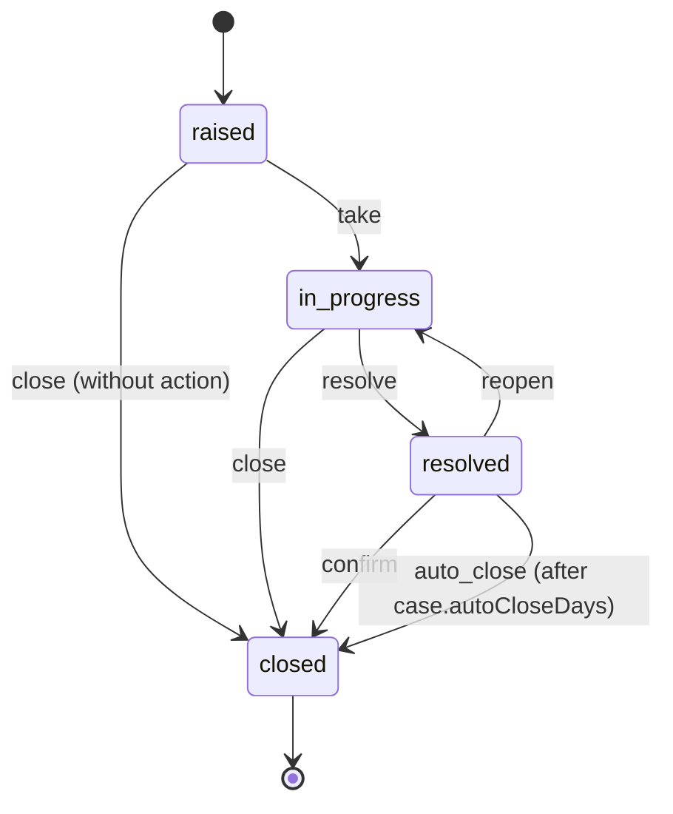

`auto_close` is an `auto` action with `when: after_days` reading `SystemSetting case.autoCloseDays`
(default 7). The runtime schedules it on entry to `resolved` under the ledger key
`feature_step_instance:<id>:auto:auto_close` and cancels it on exit.

### 9.3 `generic_request` — the sample definition, with a parallel quorum and a revision loop

```mermaid
stateDiagram-v2
    [*] --> request
    request --> withdrawn : withdraw
    request --> review : submit
    state review {
        direction LR
        state "deputy branch" as d {
            [*] --> deputy_review
            deputy_review --> deputy_done : endorse
            deputy_review --> deputy_rejected : refuse
        }
        state "committee branch" as c {
            [*] --> committee_review
            committee_review --> committee_done : endorse
            committee_review --> committee_rejected : refuse
        }
    }
    review --> decision : $join (quorum 1)
    review --> rejected : $reject (onAnyReject; the sibling branch is skipped)
    decision --> approved : approve
    decision --> rejected : refuse
    decision --> request : send_back
    approved --> [*]
    rejected --> [*]
    withdrawn --> [*]
```

This is the reference for how a parallel group compiles: the group becomes **one compound state** of
the record; each branch has its own state list plus the synthetic
`<group>.<branch>.$done`/`$rejected` states; the completion rule (`quorum(1)` here) decides when the
synthetic `review.$join` transition fires; `onAnyReject` fires `review.$reject` and marks the sibling
branches `skipped`. A leaf inside a branch is a state of that branch only, never of the record, so
the record's state stays a single answer while its branches move independently — the workflow
contract keeps the two lists disjoint (`branch_state_clash`).

`send_back` from `decision` to `request` is the revision loop: `request` is re-entered with
`sequence` incremented, and its earlier step instance and answers survive.

A **dynamic** parallel group (`branches.mode = 'dynamic'`) compiles to a single `$person` branch
template, instantiated once per person resolved at entry — the shape P17's minutes circulation uses.

### 9.4 `import_batch` — staging as a workflow

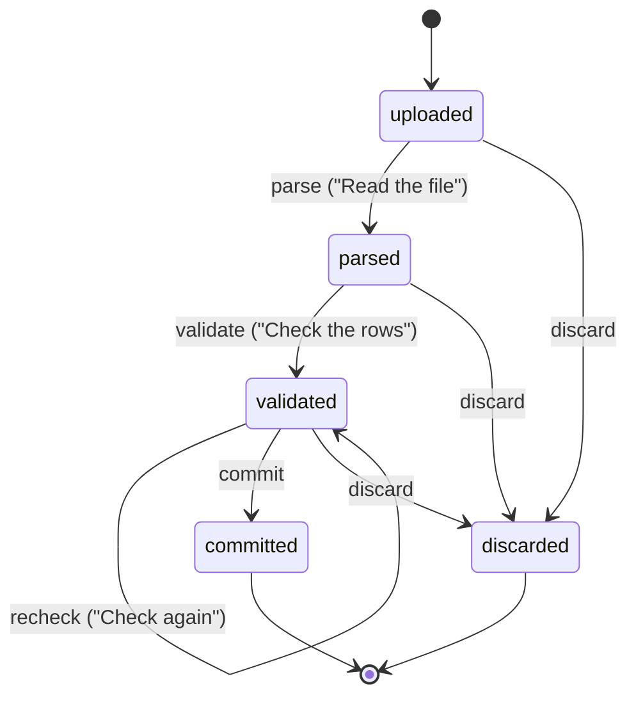

Five presets (`roster`, `class_timetable`, `assessment`, `attendance`, `students`) name the kind, its
parent subject type and its locked field defaults. The pipeline supplies only the work each state
does; the states themselves are the generic runtime's.

### 9.5 `committee` and `committee_report`

```mermaid
stateDiagram-v2
    state "committee" as C {
        [*] --> setup
        setup --> active : activate (chair must be a member; ToR attached)
        setup --> abandoned : abandon
        active --> inactive : deactivate
        inactive --> active : reactivate
        inactive --> dissolved : dissolve
        dissolved --> [*]
        abandoned --> [*]
    }
```

Two terminals with different categories: `dissolved` is a success, because a committee wound up
after doing its work did not fail; `abandoned` is the cancellation of one never constituted.
Membership is *not* a self-transition — it is edited on the committee's own panel under
`committee.manage`, closing what ended, opening what began and emitting `group.membership.changed`,
because membership changes repeatedly while the committee is at work and a transition that returns to
the same state moves nothing.

```mermaid
stateDiagram-v2
    state "committee_report" as R {
        [*] --> draft
        draft --> submitted : submit (guard committee.memberGuard)
        submitted --> reviewed : review
        submitted --> revision_required : request_revision (comment required)
        reviewed --> reviewed : escalate_issues (effect committee.escalateIssueToCase)
        reviewed --> approved : approve (effect committee.completeReportedTasks)
        reviewed --> revision_required : request_revision
        revision_required --> submitted : resubmit
        approved --> [*]
    }
```

`escalate_issues` is a `$self` action: taking the report forward turns each unsettled issue into a
`case` record without moving the report. Approving closes the tasks the report said were finished by
walking each one through its own process, so every guard, history row and notification of that
process still happens and a task whose deliverable is missing simply stays where it is.

### 9.6 `course_offering`

```mermaid
stateDiagram-v2
    [*] --> planned
    planned --> confirmed : confirm
    planned --> cancelled : cancel
    confirmed --> running : start
    confirmed --> running : auto_start (teaching period starts)
    confirmed --> cancelled : cancel
    running --> completed : complete (freezes the snapshots)
    running --> completed : auto_complete (teaching period ends)
    completed --> [*]
    cancelled --> [*]
```

### 9.7 Cross-cutting dynamics

- **Entering a step** always does the same five things: resolve the assignee, create the companion
  `Task(kind = feature_step)` unless the feature is task-backed, compute the deadline, subscribe the
  reminders, send the `onEnter` notifications. Exiting cancels what entering scheduled.
- **A step instance is never reused.** `@@unique([recordId, stepKey, branchKey, sequence])` means a
  revision loop adds an entry rather than resetting one.
- **Branch completions serialise** on the instance row, because `applyIn` locks it `FOR UPDATE`
  before reading it. Two reviewers approving simultaneously produce one join, not two.
- **A migration blocks rather than guesses.** A record inside a compound state moves only when every
  branch is mapped; an unmapped state is `$block`, and the record stays pinned to its old version.

---

## 10. Resource viewpoint

### 10.1 Docker topology

```mermaid
graph TB
    subgraph compose.yaml
        DB[("db<br/>postgres:16<br/>init.sql: roles, 3 databases,<br/>extensions, pgboss schema")]
        MP["mailpit<br/>SMTP 1025 · UI/API 8025"]
        WEB["web<br/>node:22-bookworm-slim + git<br/>npm run dev · port 3000"]
        WRK["worker<br/>playwright:v1.63.0-noble<br/>init: true · ipc: host"]
        TST["test (profile test)<br/>Vitest on the Playwright image<br/>against dept_test"]
        E2E["e2e (profile e2e)<br/>Playwright against web<br/>over the compose network"]
    end
    VOLS[("volumes: pgdata · node_modules<br/>next_dev · next_e2e · uploads · uploads_e2e")]

    WEB --> DB
    WEB --> MP
    WRK --> DB
    WRK --> MP
    TST --> DB
    E2E --> WEB
    WEB --- VOLS
    WRK --- VOLS
```

`compose.e2e.yaml` overlays a production build of `web` (`prisma migrate deploy && next build &&
next start`) on `dept_e2e` with its own `.next` and uploads volumes, `SEED_AUTO_PUBLISH=1` and
`AUTH_RATE_LIMIT=0` (the Playwright setup project signs seven seeded users in from one address).
`compose.prod.yaml` builds the `runner` targets — standalone Next for the web, an esbuild bundle for
the worker — with a one-off `migrate` service under the `ops` profile.

Named volumes for `node_modules`, `.next` and uploads, plus polling watchers
(`WATCHPACK_POLLING`, `CHOKIDAR_USEPOLLING`), are what make the Windows bind mount workable.

### 10.2 Queue catalogue

23 queues, declared once in `src/platform/scheduler/queues.ts`. `email.dead` is declared **before**
`email.send`, because pg-boss validates that a dead-letter queue exists when the referencing queue is
created.

| Queue | Policy | Retries | Expire (s) | Cron | Note |
| --- | --- | --- | --- | --- | --- |
| `outbox.dispatch` | short | 3 | 60 | `* * * * *` | Self-chaining every 5 s; the cron re-seeds after a restart |
| `reminder.materialize` | short | 2 | 300 | `0 * * * *` | Offsets inside 48 h are materialised synchronously instead |
| `reminder.fire` | standard | 3, backoff from 30 s | 120 | — | |
| `notification.deliver` | standard | 3, 15 s | 120 | — | |
| `email.dead` | standard | 0 | 60 | — | Dead letter |
| `email.send` | standard | 5, backoff from 10 s | 60 | — | → `email.dead` |
| `workflow.auto_transition` | standard | 2, 30 s | 120 | — | |
| `overdue.sweep` | short | 1 | 600 | `15 * * * *` | |
| `grant.reconcile` | short | 1 | 900 | `0 3 * * *` | Repairs derived grants |
| `calendar.autotransition` | short | 1 | 600 | `*/15 * * * *` | |
| `campaign.open` / `.close` | standard | 3, 30 s | 600 | — | |
| `campaign.aggregate` | standard | 2, 60 s | 900 | — | |
| `feature.migrate` | singleton | 3, 30 s | 1800 | — | Batches of 200, resumable |
| `recurrence.spawn` | short | 1 | 600 | `*/15 * * * *` | Per department, in a department transaction |
| `report.generate` | singleton | 2 | 600 | — | Key: report + sha256(params) + format |
| `projection.rebuild` | singleton | 1 | 1800 | — | |
| `search.reindex` | singleton | 1 | 1800 | — | |
| `import.parse` / `.validate` | standard | 1 | 900 | — | Used above 1 000 000 bytes |
| `snapshot.compute` | singleton | 2 | 900 | — | Per section offering |
| `retention.run` | short | 1 | 1800 | `0 4 * * 0` | Documents, tokens, published events, old ledger rows |
| `worker.heartbeat` | short | 0 | 30 | `* * * * *` | Feeds `/admin/jobs` |

Eight crons in total, all registered in `APP_TIMEZONE` (default `Africa/Addis_Ababa`). Every
singleton-policy queue is one whose second concurrent run would be wasted work or a double write.

### 10.3 Idempotency vocabulary

One vocabulary, stored on `ScheduledJob.idempotencyKey` or `Notification.dedupeKey` (required and
unique): `{subjectType}:{subjectId}:{scheduleKey}:{offsetDays}` for reminders,
`feature_step_instance:<id>:auto:<action>` for automatic transitions, `campaign:{id}:open|close`,
`report:{key}:{sha256(params)}:{format}`. `Scheduler.cancel(prefix)` cancels by prefix, which is how
exiting a step cancels everything that entering it scheduled.

### 10.4 Connection pooling and process limits

| Resource | Control |
| --- | --- |
| Prisma pool per process | `PG_POOL_MAX` (default 10), applied by `poolConfig()` on the `PrismaPg` adapter. The adapter is also given the `DATABASE_SCHEMA`, and for a non-`public` schema a `-c search_path` option so raw SQL resolves too. |
| Worker concurrency | `WORKER_CONCURRENCY` (default 4) |
| Concurrent PDF renders | `PDF_CONCURRENCY` (default 2), enforced by an in-process semaphore in `apps/worker/src/pdf/browser.ts` |
| Chromium | One per worker process, launched lazily with `--no-sandbox --disable-dev-shm-usage`, relaunched on `disconnected` |
| Upload size | `SystemSetting upload.maxBytes` (default 25 MiB), with `UPLOAD_MAX_MB` as the fallback |
| Import rows | `SystemSetting import.maxRows` (default 5000) |
| Parse in the request | Files up to `INLINE_LIMIT_BYTES` = 1 000 000; larger files go to the worker |
| Mass notification | `SystemSetting notify.massSendThreshold` (default 200) needs explicit confirmation |
| Document retention | `SystemSetting document.retentionDays` (default 90) |

`prismaRoot` is a `Proxy` over the current client so that changing `DATABASE_SCHEMA` re-targets it
transparently — which is what lets the integration and worker test projects share one process while
migrating into schemas of their own. Production never changes the schema.

---

## 11. Design rationale

### 11.1 Processes as data rather than hand-coded CRUD

**Decision.** A process is an authored `FeatureDefinition` compiled at publish time into the
artefacts the existing kernels run, rendered by one generic runtime.

**Alternatives rejected.** (a) Fifteen to twenty CRUD modules, each with its own pages, states and
notifications — explicitly ruled out by the requirements' own governing design rule, and the source
of the duplication the department already suffers in spreadsheets. (b) An interpreter that walks the
definition at every request — slower, untestable by snapshot, and impossible to validate ahead of
time. (c) Code generation into files — a new deployment for every process, and no way for an
administrator to change one.

**Consequences.** The compiler is pure, so every seeded built-in has a snapshot test and a
simulation; a definition can be validated and simulated before it is published; there is exactly one
implementation of the list page, the record page and the step page; and a new process costs a
document plus its adapters. The cost is indirection: a reader chasing behaviour must go from the
definition to the compiled artefacts to the effects, which is why the compiled output is stored in
`compiledJson` and shown on the administrator's page.

### 11.2 RLS rather than application-level filtering

**Decision.** PostgreSQL row-level security on every tenant table, with the runtime role holding
`NOBYPASSRLS`, is the tenancy boundary. The Prisma query extension is a safety net.

**Alternative rejected.** Extension-only scoping. Prisma query extensions do not intercept nested
reads and writes (`include`, nested `create`/`connect`) or raw SQL, so a `departmentId` injected into
top-level `where` clauses leaks the moment somebody writes an `include` or a `$queryRaw` — and the
system uses both (pg_trgm search, `ts_rank`, `FOR UPDATE`).

**Consequences.** A leak requires a PostgreSQL policy bug rather than a forgotten filter. The cost is
that every read must happen inside a transaction that has set `app.current_department_id`, which is
why `withTenantTx` exists and why the scoped client wraps raw queries too — an early version did not,
and the directory search silently returned nothing. It also forces the generator: policies written by
hand would drift, so they are generated from the DMMF, hashed into a committed manifest, and checked
by both a script and an integration test.

### 11.3 A transactional outbox rather than direct side effects

**Decision.** A change and a `DomainEvent` describing it are written in one transaction; the worker
drains the outbox and runs the subscribers, each guarded by a receipt.

**Alternatives rejected.** (a) Calling the side effect inline — a failed notification would roll back
an approval, or an approval would commit with its notification lost. (b) Enqueuing a job per side
effect — the same atomicity problem one layer out, and no replay. (c) Database triggers — invisible
to the type system and untestable at the unit level.

**Consequences.** Derived grants, search maintenance, projection updates, thread notifications and
campaign follow-ups are all the same mechanism, so adding one is a subscription. Every handler runs
at most once per event, enforced by `EventHandlerReceipt`, whose insert is rolled back with its
handler's savepoint so a failure is retried rather than skipped. `SKIP LOCKED` lets several
dispatchers coexist. The cost is eventual consistency between a change and its consequences, which is
why the people and academic services also derive grants synchronously for immediate consistency and
let the subscribers repair the drift.

### 11.4 Derived data with rebuild rather than accumulated counters

**Decision.** Dashboard projections, search index entries, per-student results and metric snapshots
are derived, declare the events after which they may be stale, and can be rebuilt wholesale.

**Alternative rejected.** Incrementing and decrementing counters on write. A counter that drifts
cannot be repaired without recomputing anyway, and every new writer must remember every counter.

**Consequences.** A rebuild costs time and never correctness, which is why `/admin/jobs` offers the
button. The built-in projections recompute their department in `apply` rather than patching the row
the event touched, because a recomputation cannot drift; the registry supports either, so a
projection over a very large table can choose to patch. Snapshots keep a `sourceHash` so an unchanged
input needs no recomputation, and a snapshot the department has reported on is frozen — derived does
not mean disposable.

### 11.5 Locked subtrees so a release and an administrator can both own parts of one document

**Decision.** A system definition has two authors. The code owns a set of RFC 6901 pointers derived
from the document itself (adapters, surfaces, guards, effects, auto rules, computed fields, source
bindings, the backing, preset adapters and defaults); the administrator owns everything else.

**Alternatives rejected.** (a) System definitions read-only — then a department cannot rename a step
or add a notification, which was the point of the builder. (b) Administrator definitions never
overwritten — then a release that renames an adapter leaves a definition pointing at code that no
longer exists. (c) A hand-maintained lock list — it would fall out of date on the first refactor.

**Consequences.** Locks are computed, never written. A save or publish that moves one is refused with
`LOCK_VIOLATION` naming the pointer; a version whose `changeNote` begins with `seed` skips the check,
because a deployment is the other author. When the code's locked hash changes and the administrator
has edited their document, the seed leaves a *merged* draft — their document with the code's locked
subtree written into it, pointers the code no longer has removed — and the admin list says a system
update is pending. "Untouched" is proved by two facts, not one: the note starts with `seed` **and**
the stored document still hashes to its own `jsonHash`.

### 11.6 Other decisions worth recording

| Decision | Alternative rejected | Reason |
| --- | --- | --- |
| The `FeatureRecord` is always the workflow subject; module rows carry `featureRecordId` | Each module row owning its own workflow instance | One place to look for a lifecycle, one set of caches, one permission scope. `Committee` and `CommitteeReport` go further and share the record's id, so `SubjectRegistry.url` can stay synchronous. |
| One `Task` table with no status column | A status column plus per-kind tables | A task's lifecycle is the `feature:task` machine; a second representation of "where is this" would immediately disagree with the first. `task_backing_check` makes an orphan Task unrepresentable. |
| `createTask` writes only the row; `createTaskRecord` owns the lifecycle | `createTask` starting a workflow | The thing being retired in P9b was a task with a lifecycle of its own. What is left without one is a row that belongs to something else: a step's companion, or a recurrence template. |
| Anonymity by database constraint | Application discipline | A promise is not a guarantee. There is no FK path from invitation to submission, the triggers refuse a respondent and an un-truncated timestamp, the audit row names no actor, and an adversarial join is a test. |
| `simple` text search configuration | `english` | The corpus is Amharic and English names, codes and titles; stemming does more harm than good. |
| Two search gates (tokens, then `can()`) | Filtering only by `can()`, or only by tokens | Checking `can()` on every row of the index is too slow; trusting coarse tokens would show somebody a record they could not open. The tokens narrow, `can()` decides. |
| The dashboard *is* `/d/[dept]` | `/d/[dept]` redirecting to `/d/[dept]/dashboard` | A redirect costs a hop and gives nothing; the department's home page was already the overview. |
| One `FormRenderer` for every question type | One component per type | The answer shape — conditional visibility, group indices, rank order — is one concern, and splitting it duplicated it. |
| Report HTML built as a string with the print stylesheet inlined | Rendering React server components to a string | The worker renders the page in a browser with no application around it; a report is a stylesheet and a table, and a string builder is the smaller thing to test and hand to Chromium. Everything interpolated goes through one `escape`. |
| Every report format stored as a `Document` | HTML and CSV returned inline | A report somebody ran is a file they may want again in ten minutes, and the runs list is where they look for it. |
| `globalSingleton` for every registry and the audit context | Module-level `Map`s | The bundler may hand a module its own copy per route chunk; three separate production-only bugs came from this before the pattern was adopted. |
| The step page stays editable unless an action is *allowed for this person* | Read-only unless an action is enabled | The submit action of an empty form is disabled precisely because the form is empty, so locking the form waits for an answer it will not let anybody give. `AvailableAction.actorAllowed` is the separate answer. |
| Required attachments derived from the document links | Trusting what the caller passes to `act` | Whether the terms of reference are attached is a fact about the slot, not a claim by the caller — and the guard asks the same question the same way. |
| Notifications rendered at notify time into `renderedJson` | Rendering the template at delivery time | The variables (subject label, deadline, days remaining) exist only at notify time; re-rendering later produced empty placeholders. |
| No template variant HTML-escaped by Mustache | Escaping in the template | Escaping belongs to the sink: `wrapHtml` for the HTML part, React for in-app. Mustache escaping turned the slashes of an invitation link into entities in the text/plain part, so the link could not be followed. |
| A weekly availability block is one template row, clipped to its own window | A row per occurrence | A term's timetable is a weekly template; without the clip, last term's classes would make everybody busy for ever. `materialiseRecurring(termId)` writes the concrete weeks, which is when they join the exclusion constraint. |
| `tsrange` in the exclusion constraint | `tstzrange` | Prisma stores `DateTime` as `timestamp(3)` without a zone, and a zone-dependent expression is not immutable, so PostgreSQL refuses it in an index expression. |
| Records pin their definition version; moving them is a separate, mapped migration | Publishing rewriting running records | Publishing must be safe at any moment. A state with no home in the new version blocks its records rather than guessing where they belong. |

`docs/design/DEVIATIONS.md` holds the full record — 130 entries at present — of where the
implementation departs from R6–R9 and why. Most are of this kind: a design that was right in
principle met a property of Next.js, Prisma or PostgreSQL, and the code took the smaller correct
path. Three deviations are deferrals rather than changes and are worth naming here: the visual
drag-and-drop step-tree editor (the behaviour the phase was about — validate, simulate, publish,
refuse a locked edit, migrate — is implemented and tested; the tree editor is a UI project of its
own), the `/admin/export-specs` screen (nothing creates a spec until P25, which is where its
requirements are actually known), and the manual-grid component for hand-typed import rows
(everything behind it exists and is tested).

---

## 12. Verification design

### 12.1 Four Vitest projects and their boundaries

`vitest.config.ts` defines four projects, sharing one coverage configuration.

| Project | Files / cases | Environment | Boundary |
| --- | --- | --- | --- |
| `unit` | 41 / 256 | node | No database, no Next, no React. The workflow machine (all completion rules, `$join`/`$reject`, dynamic branches, revision loops), the feature schema, validator (one fixture per rule code), compiler (snapshots), locks, simulator, task lifecycle snapshot and enum sync; `zodFromFields`; scheduler offsets and `notify`; mustache safety and template variables; import mapping, parsing and validators (against a stub answering the four queries a validator makes); availability arithmetic; assessment metrics; `can()` and the permission matrix; the RLS generator and schema checker; the rate limiter, environment contract and local-disk storage. |
| `components` | 7 / 25 | jsdom + Testing Library | `FormRenderer`, the record detail with its step timeline, the data table, the shell, the pattern primitives, the committees activity history. The setup file fails the run on React's nesting warnings. |
| `integration` | 49 / 231 | node, real PostgreSQL, **RLS on** | A per-run schema `it_<runid>` in `dept_test`, migrated as `dept_migrator`, exercised as `dept_app` through the real service API and the real permission checks. Suites: `tenancy` (4), `identity` (4), `workflow` (4), `feature` (7), `scheduler` (3), `academic` (2), `people` (3), `document`, `uploads`, `thread`, `forms`, `campaign` (2), `import`, `availability` (2), `search`, `reporting`, `dashboard`, `committees` (3), `events` (2), `audit`, `template`, `workitem` (2), `subject-registry`, `smoke`. `fileParallelism` is off. |
| `worker` | 11 / 27 | node, real PostgreSQL **and real pg-boss** | A per-run `pgboss_it_<runid>` schema. `enqueue-in-transaction`, `outbox-dispatch`, `reminders`, `email` (through Mailpit), `campaign-jobs`, `auto-transition`, `feature-migrate`, `import-parse`, `recurrence-spawn`, `report-pdf`, heartbeat smoke. |

The integration project also needs a pg-boss schema even without a supervising worker, because
`notify()` enqueues deliveries and `subscribeReminders()` enqueues `reminder.fire` on the caller's
transaction.

### 12.2 Playwright journeys

`playwright.config.ts` runs `tests/e2e` against the production build served by the `web` service on
`dept_e2e`, with no `webServer` (compose provides it), two workers, `fullyParallel` off, traces and
screenshots retained on failure. A `setup` project signs the seeded users in; the `chromium` project
depends on it.

Sixteen specs, one journey per phase: `p0-smoke`, `p2-login`, `select-department`, `p3-registry`,
`p4-audit`, `p5-inbox`, `p6-documents`, `p7-task-skeleton`, `p8-forms`, `p9-feature`,
`p10-availability`, `p10-import`, `p11-reports`, `p11-search`, `p11-dashboard`, `p12-committees` —
65 tests. The P13 journey is outstanding.

Two properties of the end-to-end environment are deliberate. The global setup purges Mailpit
**before** seeding, because both the container command and the setup would otherwise mail campaign
invitations and a spec could pick a link whose token had been truncated away. The reset deletes users
whose address is not in `SEED_USERS`, because invited representatives from a previous run made
"new user" flows skip the invitation mail.

### 12.3 Tenancy proofs

| Test | What it proves |
| --- | --- |
| `tests/unit/db/gen-rls.test.ts` | Classification from fixture and real schemas, snake_case names from the DMMF, deterministic SQL, the nullable variant on shared tables, a re-append emitting nothing, `--check` failing on an unclassified model. |
| `tests/integration/tenancy/rls-coverage.test.ts` | Every DMMF model is classified in the manifest, and every tenant table in the live database has `FORCE ROW LEVEL SECURITY` and a `tenant_isolation` policy. Re-run by every later phase. |
| `tests/integration/tenancy/rls-isolation.test.ts` | Parameterised over the manifest: department CS cannot read, update or delete EE rows through `dept_app`. |
| `tests/integration/tenancy/scoped-client.test.ts` | Shared-model paths, and that raw queries run inside the department setting. |
| `tests/integration/tenancy/append-only.test.ts` | `DELETE FROM audit_event` is denied; the column-guarded `domain_event` update is allowed; a locked document version refuses an update. |
| `tests/integration/smoke/db.test.ts` | `dept_app` does not hold `BYPASSRLS`; the `pgboss` schema is owned by `dept_app`; the per-run schema works. |
| `tests/unit/db/inject-department.test.ts` | A write carrying a foreign `departmentId` is rejected before it reaches the database. |

The end-to-end suite adds the black-box version: a user of one department receives a 404 on a record
URL of another.

### 12.4 Feature-builder proofs

`tests/unit/feature/` holds eight files: `schema`, `validate` (one failing fixture per rule code),
`compile` (snapshots of every seeded built-in), `simulate`, `locks`, `seeds` (the seed list matches
the documented placement table and every definition validates), `task-lifecycle` (the snapshot the
retired provisional machine left behind) and `enums-in-sync` (the schema's enum mirrors match the
generated Prisma enums). `tests/integration/feature/` holds seven: `runtime` (create → parallel quorum
→ terminal, with the Task rows, reminders and notifications), `versioning` (pinning, draft N+1, key
shadowing), `seed` (idempotency, lock enforcement, the seed-upgrade draft), `actor-rules`,
`backings`, `nav`, plus the committees suites that exercise the compiled machines from a module's
point of view. `tests/worker/feature-migrate.test.ts` proves the batched migration, including a
blocked record.

### 12.5 Coverage gates

Measured by v8 over `src/platform/**`, `src/lib/db/**` and `apps/worker/src/handlers/**`, excluding
generated code, type-only files and `index.ts` barrels.

| Scope | Lines | Functions | Branches | Statements |
| --- | --- | --- | --- | --- |
| Global | 80 | 80 | 70 | 80 |
| `src/platform/workflow/**` | 90 | — | 85 | — |
| `src/platform/identity/**` | 85 | — | — | — |
| `src/platform/feature/**` | 83 | — | 63 | — |

The feature threshold is below the intended 90/85 deliberately and temporarily: the kernel itself —
schema, validator, compiler, locks, simulator, publish, migration — is at or above the bar, and what
is short is the runtime's page-facing read models (covered by Playwright rather than Vitest) and the
branches of backings and relationship assignees that the later phases deliver. The gate still fails
on a regression and returns to 90/85 as those land. Coverage is measured across **all four**
projects (`npm run test:coverage`), because measuring only the database projects reports the feature
kernel at 76 % and fails a threshold the whole suite clears — the thresholds describe the code, not
one project's share of it.

### 12.6 How a phase is verified

`scripts/verify.ps1` (PowerShell) and `scripts/verify.sh` run five steps, entirely through
`docker compose`:

1. `prisma validate && npm run schema:check && next typegen && tsc --noEmit && eslint . && npm run rls:check`
2. `vitest run --project unit --project components`
3. `vitest run --project integration --project worker --coverage`
4. bring the end-to-end stack up with `--wait`, run Playwright, bring it down
5. on kernel phases, `docker compose -f compose.prod.yaml build web worker`

Then the phase's manual smoke check in the browser at `http://localhost:3000` with the seeded users
and Mailpit at `http://localhost:8025`, and only then the commit. Each phase is a branch
(`feat/p<N>-<topic>`), pushed and merged into `main` through a pull request.
`.github/workflows/ci.yml` mirrors steps 1–3 but is `on: workflow_dispatch`, so it never runs on
push until it is switched on.

### 12.7 Fixtures

Spreadsheet fixtures are described in `tests/fixtures/workbooks.ts` and written to disk by
`build-fixtures.ts` for Playwright; the unit and integration tests use the buffers directly, so a
test that fails does so for one reason rather than two. No binary fixture is committed.
