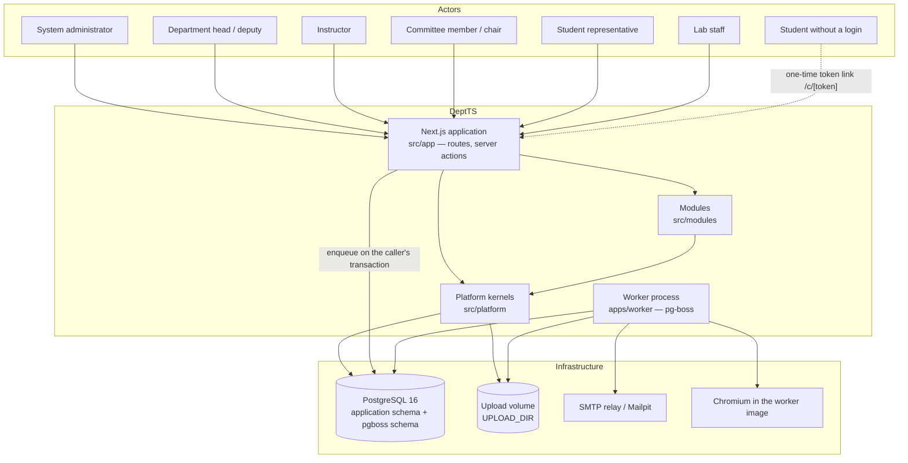
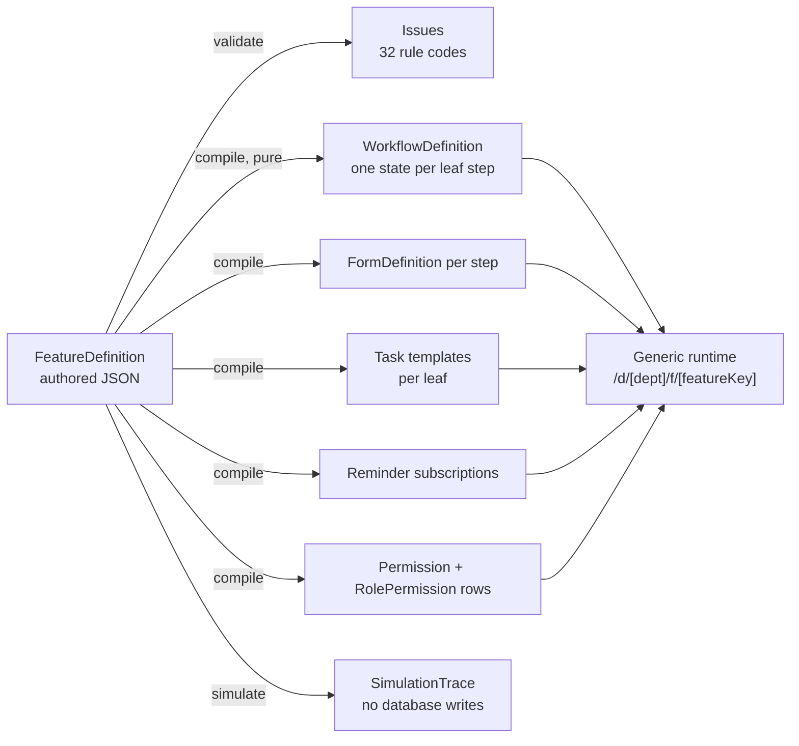

# Software Requirements Specification — DeptTS

**Department Management Tool Suite for a university academic department**

Structured according to IEEE 830-1998, *Recommended Practice for Software Requirements
Specifications*. This document describes the system as it exists in this repository at
commit `33704e7` (phases P0–P12 merged into `main`) together with the phase P13 work present in
the working tree. Requirements that the design intends but the code does not yet contain are
stated as deferred and carry the phase that delivers them.

---

## Table of contents

1. [Introduction](#1-introduction)
   - [1.1 Purpose](#11-purpose)
   - [1.2 Scope](#12-scope)
   - [1.3 Definitions, acronyms and abbreviations](#13-definitions-acronyms-and-abbreviations)
   - [1.4 References](#14-references)
   - [1.5 Overview](#15-overview)
2. [Overall description](#2-overall-description)
   - [2.1 Product perspective](#21-product-perspective)
   - [2.2 Product functions](#22-product-functions)
   - [2.3 User characteristics](#23-user-characteristics)
   - [2.4 Constraints](#24-constraints)
   - [2.5 Assumptions and dependencies](#25-assumptions-and-dependencies)
   - [2.6 Apportioning of requirements](#26-apportioning-of-requirements)
3. [Specific requirements](#3-specific-requirements)
   - [3.1 External interface requirements](#31-external-interface-requirements)
   - [3.2 Functional requirements](#32-functional-requirements)
   - [3.3 Non-functional requirements](#33-non-functional-requirements)
   - [3.4 Data requirements](#34-data-requirements)
4. [Traceability](#4-traceability)

---

## 1. Introduction

### 1.1 Purpose

This specification states what the DeptTS software must do and how conformance is judged. It is
written for three readers: an engineer joining the build who needs the requirement behind a piece
of code, an assessor who must decide whether the delivered system meets its requirements, and the
department staff who commissioned it and must recognise their own work in it.

The requirements below are derived from the approved implementation plan
(`docs/design/00-plan.md`) and the architecture blueprint, and every one of them has been checked
against the code. Where a requirement is verifiable by an automated test in this repository, the
test file is named in the requirement's *Verification* column. Where the design intends behaviour
that is not yet implemented, the requirement is marked **Deferred** and attributed to its phase.

### 1.2 Scope

DeptTS is a single web application, with one background worker process, that runs the day-to-day
administration of academic departments in a faculty: committees and their reports, tasks and
follow-up cases, the academic registry and calendar, course offerings, assessment marks and the
figures derived from them, questionnaire campaigns, spreadsheet imports, documents and
discussions, a busy-time ledger for people and rooms, notifications and reminders, reports in four
formats, one search box over everything and a dashboard per role.

The governing design rule is that DeptTS is *not* a collection of independent CRUD modules. Seven
capabilities — workflow, forms and campaigns, work items, scheduler and notifications, templates,
documents, identity — are platform services under `src/platform/`, and every user-facing process is
a thin composition over them. The composition itself is data: an administrator authors a
**feature definition** and publishing compiles it into a workflow definition, a form per step, task
and reminder templates and permission rows, which one generic runtime renders. Seven processes
(`task`, `case`, `generic_request`, `import_batch`, `committee`, `committee_report`,
`course_offering`) are shipped as seeded definitions rather than as hand-written modules.

In scope: multi-department (faculty-wide) tenancy from the first release; local accounts created by
an administrator, with no self sign-up; storage of uploaded files on a local disk volume behind a
provider interface; Gregorian dates only; a single application timezone.

Out of scope for this specification: student-facing course registration, finance, payroll, human
resources beyond staff profiles, timetable *generation* (DeptTS imports and checks timetables but
does not solve them), and any calendar-conversion layer.

### 1.3 Definitions, acronyms and abbreviations

| Term | Meaning in DeptTS |
| --- | --- |
| **Faculty** | The whole installation. Rows with no department (`department_id IS NULL`) are faculty-wide. |
| **Department** | The tenancy unit. One `Department` row per department; `Department.id` equals the better-auth `Organization.id`, and `Organization.slug` (the lower-case department code) is the `[dept]` URL segment. |
| **Tenant table** | A table with a required `departmentId`, protected by a row-level-security policy. 61 of 91 tables. |
| **Shared table** | A table with a nullable `departmentId`, where `NULL` means faculty-wide and a departmental row overrides it. 12 tables. |
| **Global table** | A table with no `departmentId` (authentication tables, `person`, `permission`, `system_setting`, …). 18 tables. |
| **RLS** | PostgreSQL Row-Level Security. In DeptTS it is the tenancy boundary, not a convenience: the runtime database role has `NOBYPASSRLS`. |
| **Feature definition** | The authored document describing a process: navigation, scope, parent, record fields, a tree of steps with forms, assignees, actions, deadlines, reminders and notifications, terminal states, list views and counters. Validated by `FeatureDefinitionSchema` in `src/platform/feature/schema.ts`. |
| **Feature record** | One instance of a process — `FeatureRecord`. It is always the subject the workflow instance moves; module rows (`Committee`, `CommitteeReport`, `CourseOffering`) carry `featureRecordId` and never a workflow instance of their own. |
| **Step instance** | `FeatureStepInstance`: one entry into one step of one record. `sequence` counts re-entries caused by revision loops. |
| **Preset** | A named variant of one feature definition (task kinds, import kinds), supplying locked field defaults, per-step form overrides, adapter overrides and optionally its own permission prefix and parent type. |
| **Locked subtree / locked path** | An RFC 6901 JSON pointer inside a system definition that an administrator may not change, because it names TypeScript that must exist. Derived from the document itself by `src/platform/feature/locks.ts`, never hand-maintained. |
| **Seed upgrade** | The draft version the seed leaves when a release changes a locked pointer of a definition an administrator has edited: their document with the new locked subtree merged into it. |
| **Adapter** | Registered TypeScript a definition may name but cannot express: a guard, an effect, an `on_enter`/`on_exit` hook, a record backing, a computed field, a source binding. Held in the AdapterRegistry and mirrored into `adapter_registration`. |
| **Surface** | React a module contributes to the generic record page (a task's deliverable slots, an import's rows). Registered by the page, because surfaces are components. |
| **Subject / SubjectRef** | `{subjectType, subjectId}`. Every kernel service addresses any entity this way. |
| **SubjectRegistry** | The contract each owning service implements per subject type: `label`, `snapshot`, `contextOf`, `relationships`, `variables`, `indexDoc`, `url`. |
| **Grant** | A `RoleGrant` row: a role held by a user, optionally scoped (department, committee, section, programme, section offering, lab schedule, meeting, feature record) and time-bounded. `source = manual` or `derived`. |
| **Derived grant** | A grant synchronised from a registry fact (committee membership, chairmanship, teaching assignment, section representative) by an outbox subscriber and repaired nightly by `grant.reconcile`. |
| **Level** | What a role's permission row grants: `full`, `manage`, `review`, `own`, `assigned`, `participate`, `limited`, `view`, `submit`, plus the explicit deny `none`. |
| **Scope** | Where a record reaches: faculty (stored as `global`), department, programme or section. |
| **Outbox** | `DomainEvent`: an event row written in the same transaction as the change it describes, drained by the worker's `outbox.dispatch` job, with one `EventHandlerReceipt` per event and handler so a handler never runs twice. |
| **Projection** | A kept answer to a dashboard question, declaring the events after which it may be stale and how to rebuild itself from the tables. |
| **Widget / layout** | A widget builds one dashboard card and knows who may see it; a layout says which widgets a role sees and in what order. |
| **Validator / committer** | The two registrations that make a kind of spreadsheet importable: a validator sees every row at once and answers per row; a committer runs inside the commit transaction with rows a validator already understood. |
| **Snapshot** | `CourseMetricsSnapshot`: the figures for one section or one whole offering at a moment in time. A frozen snapshot is immutable. |
| **k-anonymity** | Suppression of aggregated cells whose response count is below `SystemSetting campaign.kThreshold` (default 5). |
| **Anonymity (structural)** | For an anonymous campaign the database refuses a submission carrying a respondent or an invitation and refuses a timestamp that is not truncated to the day. |
| **DH / DPT** | Department Head / Deputy Department Head. |
| **CQI** | Continuous Quality Improvement — the comparison-and-action chain attached to a course portfolio (deferred to P14). |
| **ToR** | Terms of reference (of a committee). |
| **WCAG 2.2 AA** | Web Content Accessibility Guidelines 2.2, conformance level AA. |

### 1.4 References

| Ref | Document |
| --- | --- |
| R1 | IEEE Std 830-1998, *Recommended Practice for Software Requirements Specifications* |
| R2 | IEEE Std 1016-2009, *Standard for Information Technology — Systems Design — Software Design Descriptions* |
| R3 | `docs/design/00-plan.md` — approved implementation plan: decisions, verified tech stack, the 29-phase table, verification strategy |
| R4 | `docs/design/01-blueprint-entities-services.md` — entities and service contracts |
| R5 | `docs/design/02-blueprint-modules-workflows-engines.md` — module decomposition, the fourteen workflows, engine designs |
| R6 | `docs/design/03-feature-builder-runtime-seeds.md` — the feature definition aggregate, compiler, validator, runtime, seeded built-ins, locks |
| R7 | `docs/design/04-prisma-schema-tenancy-auth.md` — data model, tenancy classification, authentication and authorisation |
| R8 | `docs/design/05-repository-docker-worker-testing.md` — repository layout, Docker topology, worker and queues, testing strategy |
| R9 | `docs/design/06-phases-P0-P11-detailed.md`, `docs/design/07-phases-P12-P28-detailed.md` — long-form phase specifications |
| R10 | `docs/design/08-ui-standard.md` — the user-interface standard, with its researched sources |
| R11 | `docs/design/DEVIATIONS.md` — every recorded departure of the implementation from R6–R9, with its reason |
| R12 | `README.md` — the architecture story and the operating commands |
| R13 | W3C, *Web Content Accessibility Guidelines 2.2* |
| R14 | `docs/SDD.md` — the software design description for this system |

### 1.5 Overview

Clause 2 describes the system in context: where it sits, what it does in broad groups, who uses it,
what constrains it, and what has been deferred. Clause 3 is the body of the specification:
external interfaces (3.1), functional requirements by subsystem (3.2), non-functional
requirements (3.3) and data requirements (3.4). Clause 4 traces requirement groups to build phases
and verifying tests.

Requirement identifiers are `FR-<AREA>-<nnn>` for functional and `NFR-<AREA>-<nnn>` for
non-functional requirements. Each requirement is stated so that it can be judged true or false
against the running system.

---

## 2. Overall description

### 2.1 Product perspective

DeptTS replaces paper, electronic mail and unshared spreadsheets with one store of record. It is a
self-contained application: it depends on PostgreSQL for all persistence (including its job
queue), on an SMTP relay for outbound mail, and on a local disk volume for uploaded files. It has
no synchronous integration with any external system. Two asynchronous data exchanges exist by
design: spreadsheets arrive through the staged import pipeline, and tabular exports leave through a
versioned `ExportFormatSpec` (the export-spec renderer and its tests are in place; the load-assigner
exchange that uses it is deferred to P25).

The position of the feature builder is what distinguishes this product. It is a kernel beside the
others, not an application on top of them:

### 2.2 Product functions

Grouped by capability. Each group maps to a subsection of 3.2.

1. **Authentication and departments.** Administrator-provisioned local accounts, email and
   password, verified email, password reset and set-password mail, department selection and
   switching, department creation.
2. **Authorisation.** A configurable permission matrix of 59 permission keys over 8 roles,
   evaluated by one decision point `can()` with nine grantable levels; scoped and time-bounded
   grants, some of them derived from registry facts and reconciled nightly.
3. **Process composition (the feature builder).** Authoring, validating, simulating, publishing and
   versioning feature definitions; locked subtrees that protect code-backed parts; seed upgrades;
   record-level version pinning and a batched migration with an administrator-written state map.
4. **Process execution (the generic runtime).** Creating a numbered record, entering steps,
   resolving assignees, computing deadlines, subscribing reminders, sending notifications, applying
   actions through guards and effects, parallel branches with quorum, revision loops, terminal
   states.
5. **Work items.** One `Task` table for every task-like thing; assignments to a person, a group or a
   snapshotted audience; deliverable slots that gate submission; acknowledgement and decline
   through the notification inbox; recurrence; a personal queue.
6. **Forms and campaigns.** Versioned question sets over 25 question types with dynamic option
   bindings; validation generated from the definition; normalised answers; windowed campaigns over
   a resolved audience with hashed one-time tokens, three anonymity modes and k-anonymity
   suppression.
7. **Documents and discussions.** Immutable versions on a storage provider, polymorphic links with
   link roles, signed time-limited downloads, version locking by an approving transition,
   retention; threads and comments with mentions.
8. **Notifications, templates and reminders.** A per-user inbox that is the single acknowledge and
   decline mechanism; per-channel delivery with preferences; versioned logic-less templates with
   declared variables; reminder schedules anchored to deadlines or calendar periods.
9. **Academic registry and calendar.** Academic years with quarter boundaries, terms, typed calendar
   periods, programmes, cohort sections, courses with lineage, course and section offerings,
   teaching assignments, enrolments, weekly timetable slots, rooms and labs; calendar anchors that
   turn a period edge into a deadline.
10. **Availability and conflict.** One busy-time ledger for persons and resources, written only by
    the module that owns the source; a database-enforced ban on overlapping hard blocks; policies,
    free slots, workload and assignee suggestion.
11. **Tabular import.** One staged pipeline — upload, parse, map columns, validate, preview, correct,
    commit — expressed as a seeded workflow, with per-kind validators and committers and saved
    column-mapping profiles.
12. **Reporting.** Registered reports rendered as HTML, CSV, XLSX or A4 PDF through one path, stored
    as documents, deduplicated by report, parameters and format; PDF and workbook rendering in the
    worker.
13. **Search.** One index over every subject that describes itself, with coarse ACL tokens as the
    first gate and `can()` as the second; typed suggestions for the command palette; incremental
    maintenance by outbox subscribers and wholesale rebuild.
14. **Dashboards.** Projections kept current inside the dispatcher's transaction and rebuildable;
    widgets and per-role layouts; the department home page built from registrations.
15. **Committees.** A committee whose membership is a `Group`; constitution, standing down,
    reactivation and dissolution; committee reports whose unsettled issues become cases and whose
    approval closes the tasks it reported finished.
16. **Assessment (P13, in the working tree).** Assessment schemes and components, imported marks,
    derived per-student results, metric snapshots with freezing, and the `course_offering`
    lifecycle.
17. **Audit and events.** Field-level audit of every write, append-only enforced by the database; a
    transactional outbox with idempotent handlers.
18. **Administration.** Users, departments, the permission matrix, system settings, feature
    definitions and migrations, forms, workflows (read-only), templates, reminder schedules with a
    dry run, the job ledger with outbox backlog and rebuild buttons, and the audit trail.

### 2.3 User characteristics

Roles are defined once in `src/lib/auth/access.ts` (seven department-membership roles for the
better-auth organization plugin) and again as data in
`src/platform/identity/permissions-matrix.ts` (`ROLES`, eight entries, because `committee_chair`
exists only as a derived scoped grant). The global System Administrator is the better-auth admin
plugin's `user.role === 'admin'` and is not a membership role.

| Role | Origin | Characteristics and expected use |
| --- | --- | --- |
| System administrator | `user.role = 'admin'` | Faculty-wide. Creates departments and users, edits the permission matrix and system settings, authors and publishes feature definitions, runs migrations, watches the job ledger. Technically confident; the only role with access to `/admin`. `can()` allows every key except `evaluation.participate` and `campaign.respond`. |
| Department head | membership role `department_head` | `full` on every permission key except `feature.manage`. The heaviest daily user: opens the dashboard to see who is carrying what, assigns and reviews work, reads committee reports, approves. |
| Deputy head | membership role `deputy_head` | `manage` on every key except `feature.manage` and `admin.department`, minus the keys listed in `SystemSetting rbac.manageExcludedPermissions` (by default `portfolio.approve`, `evaluation.close`, `evaluation.analyze`, `plan.approve`, `minutes.approve`). |
| Instructor | membership role `instructor` | `assigned` on task and assessment keys, `own` on their own portfolio and profile, `participate` on campaigns, `view` on staff, resources and documents. Uses My Work, uploads deliverables, imports marks for sections they teach, declares availability. |
| Committee member | membership role `committee_member`, plus a derived `committee_member@committee` grant | `assigned` on committee, task and meeting keys. Writes committee reports. Sees only the committees they are on. |
| Committee chair | derived scoped grant `committee_chair@committee` only | Everything a member has plus `committee.task.manage` and `meeting.manage`. Must be a member of the committee to be its chair (guard `committee.chairIsMember`). |
| Student representative | membership role `student_rep`, plus a derived `student_rep@section` grant | `limited` on task and meeting keys (read and comment), `participate` on campaigns, `submit` on add/drop, elective and appointment keys. Auto-invited to an account when assigned. |
| Student | membership role `student` | `participate` and `submit` only. In this release most students have no login and answer through one-time token links; a login is possible. |
| Lab staff | membership role `lab_staff`, plus a derived `lab_staff@lab_schedule` grant | `assigned` on task keys and `lab.task.manage`, `view` on their own duties and on resources. |

Everyone reaches DeptTS in a desktop or mobile browser. A person without a login is addressed only
by email, through a hashed one-time token at `/c/[token]`.

### 2.4 Constraints

| Id | Constraint |
| --- | --- |
| C-1 | **Multi-tenancy is enforced by PostgreSQL, not by the application.** Every tenant table has `ENABLE`/`FORCE ROW LEVEL SECURITY` and a `tenant_isolation` policy on `department_id = current_setting('app.current_department_id', true) OR current_setting('app.tenant_bypass', true) = 'on'`. The runtime role `dept_app` is `NOBYPASSRLS`; only `dept_migrator` (migrations, seeds, test resets) may bypass. The policies are generated from the Prisma DMMF by `prisma/scripts/gen-rls.ts`, and `npm run rls:check` fails the build when the manifest is stale or a tenant table is uncovered. |
| C-2 | **Append-only tables.** `audit_event`, `workflow_transition_log` and `event_handler_receipt` have `UPDATE`/`DELETE` revoked from `dept_app` and a `raise_immutable()` trigger. `domain_event` permits updates only to its delivery columns and deletion only of published rows. A frozen `course_metrics_snapshot` refuses every update. A locked `document_version` refuses every update, and only the lock and extracted-text columns are writable at all. |
| C-3 | **Development and verification run entirely inside Docker.** The host needs only Docker Desktop and git; every Node command runs in the `web`, `worker`, `test` or `e2e` compose service on Node 22. |
| C-4 | **Gregorian dates only.** No calendar-conversion layer. Ethiopian practice is reflected by the default application timezone `Africa/Addis_Ababa` and by `AcademicYear.quarterBoundariesJson`, which carries the four quarter boundaries quarterly reporting is based on. |
| C-5 | **One application timezone** (`APP_TIMEZONE`) for cron registration and rendering. Weekly availability blocks and timetable slots are wall-clock facts about that clock. |
| C-6 | **Anonymity of anonymous campaigns is structural.** There is no foreign-key path from an invitation to a submission; a trigger refuses a respondent or an invitation on an anonymous submission and refuses a timestamp that is not day-truncated. |
| C-7 | **k-anonymity.** Aggregated cells with fewer responses than `SystemSetting campaign.kThreshold` (default 5) are stored with `suppressed = true` and no statistics at all. |
| C-8 | **Architectural boundaries are lint-enforced.** `src/platform/**` may not import `next/*`, `react`, `server-only`, `src/modules/**`, `src/app/**` or `src/components/**`; `src/modules/**` may import only its own files, `src/platform`, `src/lib` and `src/components`; `apps/worker/**` may import neither Next nor React (`eslint.config.mjs`). |
| C-9 | **Exact dependency pinning.** `.npmrc` sets `save-exact=true`; `prisma`, `@prisma/client` and `@prisma/adapter-pg` are pinned to 7.10.0 because the CLI's npm `latest` is an 8.0 release candidate with a different configuration shape. |
| C-10 | **No self sign-up.** `emailAndPassword.disableSignUp` is true and `requireEmailVerification` is on; users exist because an administrator created them. |
| C-11 | **Files live only in the document service.** Uploads go through `POST /api/uploads` (server actions cap bodies at 1 MB), keys are provider-generated `yyyy/mm/<32 hex>`, and downloads are five-minute signed links bound to the issuing user. |
| C-12 | **No workers inside the web process.** The web process only sends jobs, always on the caller's Prisma transaction, so a rolled-back action leaves no job behind. |
| C-13 | **Prisma migrations never touch the `pgboss` schema**, which is owned and migrated by `dept_app`. |
| C-14 | **Continuous integration is manual-only.** `.github/workflows/ci.yml` is `on: workflow_dispatch`; verification is run locally by `scripts/verify.ps1` / `scripts/verify.sh`. |

### 2.5 Assumptions and dependencies

| Id | Assumption or dependency |
| --- | --- |
| A-1 | PostgreSQL 16 or later, with the `pg_trgm` and `btree_gist` extensions installed in `public`. |
| A-2 | Node.js ≥ 22.12 (`engines.node`). The load-bearing versions are next 16.3.5, react 19.3.0, prisma 7.10.0, better-auth 1.7.5, pg-boss 12.33.1, zod 4.6.5, playwright 1.63.0, vitest 5.0.1, tailwindcss 4.3.3, typescript 5.9.3. |
| A-3 | An SMTP relay is reachable at `SMTP_URL`. Development and end-to-end runs use Mailpit, whose HTTP API the Playwright fixtures read. |
| A-4 | The worker image contains Chromium (`mcr.microsoft.com/playwright:v1.63.0-noble`); the web image does not. |
| A-5 | `Person.email` is present for everybody who must be reachable, including students who have no login. |
| A-6 | Beyond representatives, students have no accounts in this release; representatives are auto-invited when assigned. |
| A-7 | One portfolio per instructor and course offering, covering all their sections; attendance is captured as narrative unless `SystemSetting attendanceCaptureMode = per_student`. |
| A-8 | The department's grade scale is configuration (`Program.gradeScaleKey`, resolved by `src/modules/assessment/grade-scales.ts`), not code. |
| A-9 | Uploaded spreadsheets are `.xlsx` or CSV; `exceljs-hardened@5.0.0` is used instead of upstream `exceljs`, which has an unfixed prototype-pollution advisory. |
| A-10 | A real load-assigner sample workbook is expected before P25; a golden fixture stands in until then. |

### 2.6 Apportioning of requirements

Phases P0–P12 are merged into `main`. P13 (assessment) exists in the working tree: schema,
migrations, the `src/modules/assessment` module, three import presets, the `course_offering` seed
and `tests/unit/assessment/metrics.test.ts`. Its integration tests and its end-to-end journey are
not yet written, and the `course_performance` report the plan names is not yet registered.

The following are specified by R5–R9 and deliberately absent from the code. They are requirements of
the product, not of this release.

| Deferred capability | Phase | Present today |
| --- | --- | --- |
| Course portfolios and the CQI comparison chain | P14 | `AssessmentScheme`…`CourseMetricsSnapshot` exist; `Portfolio`, `PortfolioScope`, `CQIReport`, `CQIItem` do not (`portfolio.prisma` holds only the assessment half). |
| Campaign as a feature with add/drop, elective and preference presets | P15 | The campaign kernel, tokens, anonymity and aggregation exist; `Campaign.featureRecordId` is nullable and no `campaign` definition is seeded. |
| Evaluation and survey presets, per-subject evaluation reports | P16 | k-anonymity suppression and the three anonymity modes exist; the presets and evaluation reports do not. |
| Meetings, agendas, decisions, minutes circulation | P17 | `meeting.prisma` is a placeholder. |
| Appointments and the public intake at `/a/[hostSlug]` | P18 | Availability policies and free slots exist; the appointment feature and the public route do not. |
| Role dashboards for every seeded role, module projections (`openIssues`, `staffActivity`, `portfolioStatus`) | P19 | Four layouts (`department_head`, `deputy_head`, `committee_chair`, `default`) and three projections (`openWork`, `pendingByFeature`, `campaignProgress`). |
| Annual plans, planned activities, quarterly reports | P20 | `planning.prisma` is a placeholder. |
| Invigilation, exam schedules, duty assignment | P21 | `scheduling.prisma` is a placeholder. |
| Laboratory schedules and lab staff duties | P22 | as above. |
| Assets and maintenance | P23 | `resource.prisma` is a placeholder; `Resource` (rooms and labs) is in `academic.prisma`. |
| Staff profile views and the staff report set | P24 | `StaffProfile` and `ProfileItem` exist with people pages; the derived views and reports do not. |
| Load-assignment bridge, `ExportFormatSpec` administration | P25 | `ExportFormatSpec` and `src/platform/reporting/export-spec.ts` exist and are unit-tested; no spec is seeded and `/admin/export-specs` does not exist. |
| Announcements, conversations, section issues | P26 | — |
| PDF and DOCX text extraction, `document.extract` queue, audit filters and export | P27 | Extraction covers text, CSV and markdown; the audit page has no filters or export. |
| Retention execution, nonce CSP and security response headers, public-route rate limiting, upload scanning, SMS channel | P28 | The retention job and provider registry exist; `next.config.ts` has no `headers()`; rate limiting covers uploads, the campaign token route and better-auth's own endpoints. |

---

## 3. Specific requirements

### 3.1 External interface requirements

#### 3.1.1 User interfaces

| Id | Requirement | Verification |
| --- | --- | --- |
| FR-UI-001 | Every authenticated screen is rendered inside one application shell providing a collapsible grouped sidebar with an active state, a header with breadcrumb, command palette, inbox badge, user menu and theme toggle (`src/components/shell/`). | `tests/components/patterns/shell.test.tsx` |
| FR-UI-002 | Screens are composed from the shared pattern layer — `PageHeader`, `StatCard`, `DataTable`, `EmptyState`, `FormSection`, `ConfirmButton`, `ListLayout`, `SegmentedLinks`, `PageSkeleton` — and from official shadcn/ui primitives under `src/components/ui`. A page needing a new pattern adds it to the layer and to R10 first. | `tests/components/patterns/primitives.test.tsx` |
| FR-UI-003 | Any list of more than about ten rows is a real table: sortable, text-filterable, column-toggleable, paginated, with explicit empty and loading states, every action reachable by keyboard. | `tests/components/patterns/data-table.test.tsx` |
| FR-UI-004 | Every empty state states the system status, teaches what fills the space and offers a direct pathway. | `tests/components/patterns/primitives.test.tsx` |
| FR-UI-005 | Route transitions show a title-and-list skeleton through `loading.tsx` boundaries, never a spinner. | `src/app/(app)/d/[dept]/loading.tsx`, `src/app/(admin)/admin/loading.tsx` |
| FR-UI-006 | The outcome of every server action is reported by a toast, and the action's own error message is shown rather than a generic failure; the user's input is preserved. | `src/lib/actions/safe-action.ts`, `src/lib/actions/form.ts` |
| FR-UI-007 | The command palette (Ctrl/⌘ K) offers navigation targets and record suggestions from the search index. | `src/components/shell/CommandPalette.tsx`, `tests/e2e/p11-search.spec.ts` |
| FR-UI-008 | The page title is the only `h1`; card titles render as `h2` so card sections are reachable by heading navigation. | `tests/components/patterns/primitives.test.tsx` |
| FR-UI-009 | Filter, window and scope switches live in the query string so a view is shareable and works without client JavaScript. | `src/components/patterns/SegmentedLinks.tsx` |
| FR-UI-010 | On a phone the sidebar becomes a sheet, tables gain horizontal scroll, forms stack, and nothing depends on hover alone. | `docs/design/08-ui-standard.md` §9; manual check |

#### 3.1.2 Hardware interfaces

DeptTS requires no hardware beyond a server able to run the Docker images and a browser. Storage is
a mounted volume at `UPLOAD_DIR` (default `/data/uploads`).

#### 3.1.3 Software interfaces

| Id | Interface | Requirement |
| --- | --- | --- |
| FR-EXT-001 | **PostgreSQL 16** | All persistence, through Prisma 7 with the mandatory `@prisma/adapter-pg` driver adapter. Two roles: `dept_migrator` (owner, `BYPASSRLS`, `CREATEDB`) for migrations, seeds and test resets; `dept_app` (`NOBYPASSRLS`) for the web process, the worker and integration tests. Databases `dept`, `dept_test`, `dept_e2e`. Verified by `tests/integration/smoke/db.test.ts`. |
| FR-EXT-002 | **pg-boss 12 job queue** | Its own `pgboss` schema, owned and migrated by `dept_app`, never touched by Prisma. The worker creates every queue of `src/platform/scheduler/queues.ts` at boot and registers its crons in `APP_TIMEZONE`. The web process sends only, on the caller's transaction via `fromPrisma(tx)`. Verified by `tests/worker/enqueue-in-transaction.test.ts`. |
| FR-EXT-003 | **SMTP** | Outbound mail through `nodemailer` to `SMTP_URL`, from `MAIL_FROM`; bodies rendered from React Email components. The `email.send` queue retries five times with backoff and dead-letters to `email.dead`. Verified by `tests/worker/email.test.ts`. |
| FR-EXT-004 | **Storage provider** | `StorageProvider` (`put`, `get`, `delete`, `exists`) with a local-disk implementation and an S3 stub. Keys are provider-generated and must match `^\d{4}/(0[1-9]\|1[0-2])/[a-f0-9]{32}$`. Verified by `tests/unit/storage/local-disk.test.ts`. |
| FR-EXT-005 | **Chromium** | A single Chromium instance per worker process renders A4 PDFs, relaunched if it disconnects, with concurrent renders limited to `PDF_CONCURRENCY`. Verified by `tests/worker/report-pdf.test.ts`. |
| FR-EXT-006 | **Spreadsheets** | `.xlsx` read and written with `exceljs-hardened`; CSV with `papaparse`, written with a byte-order mark. |
| FR-EXT-007 | **Authentication library** | better-auth 1.7.5 with the `admin` and `organization` plugins, mounted at `/api/auth/[...all]`; `nextCookies()` is the last plugin. Department = Organization. |

#### 3.1.4 Communications interfaces

| Id | Requirement |
| --- | --- |
| FR-HTTP-001 | The HTTP surface is grouped as `(auth)` — `/login`, `/reset-password?token=`, `/set-password?token=`, `/select-department`; `(app)` — everything under `/d/[dept]`; `(admin)` — everything under `/admin`; plus the public token route `/c/[token]` and the API routes. |
| FR-HTTP-002 | The generic feature runtime serves `/d/[dept]/f/[featureKey]`, `.../new`, `.../[recordId]`, `.../[recordId]/steps/[stepKey]`, `.../[recordId]/history`, and `/d/[dept]/f/record/[recordId]` resolves a record by id alone. |
| FR-HTTP-003 | Built-in processes keep readable URLs by rewrite, with exactly one implementation of each page: `/d/:dept/tasks`, `/cases`, `/committees` and `/imports` (and their sub-paths) rewrite onto `/d/:dept/f/{task,case,committee,import_batch}` (`next.config.ts`). |
| FR-HTTP-004 | `POST /api/uploads` accepts multipart uploads, applies the size cap from `SystemSetting upload.maxBytes`, checks magic bytes with `file-type`, validates CSV by parsing it, and validates every requested link through the SubjectRegistry. |
| FR-HTTP-005 | `GET /api/documents/[id]/v/[versionNo]/download` serves a version only against a valid five-minute signed token that carries the document, version, department and issuing user, and only to that same session. The download is audited. |
| FR-HTTP-006 | `GET /api/health` returns `{ok:true}` without authentication and is the container health check. |
| FR-HTTP-007 | `src/proxy.ts` performs optimistic session-cookie redirects only; every layout, page, server action and route handler re-checks the session and the permission. Its matcher excludes `api/auth`, `api/health`, `_next`, static assets and the public `c/` and `a/` prefixes. |
| FR-HTTP-008 | Server actions accept only Zod-validated input carrying the department slug, and return a discriminated result object; they never throw to the client except for Next.js control flow. |

### 3.2 Functional requirements

#### 3.2.1 Authentication and departments as organizations

| Id | Requirement | Verification |
| --- | --- | --- |
| FR-AUTH-001 | The system shall authenticate with email and password, with sign-up disabled and email verification required; the minimum password length is 10. | `tests/e2e/p2-login.spec.ts` |
| FR-AUTH-002 | `identityService.provisionUser()` shall create a user with a random password and verified email, link a `Person` to it, add the department membership and send a set-password mail. | `tests/integration/identity/users.test.ts` |
| FR-AUTH-003 | A password reset shall be requestable by email and completed through `/reset-password?token=`. | `tests/e2e/p2-login.spec.ts` |
| FR-AUTH-004 | `departmentService.create` shall write the `organization` and `department` rows in one Prisma transaction with `Department.id = Organization.id`, so no caller becomes a member as a side effect. | `tests/integration/identity/department-org.test.ts` |
| FR-AUTH-005 | A user may belong to up to 5000 departments with one or more comma-separated membership roles each; `/select-department` lists the departments they may enter. | `tests/e2e/select-department.spec.ts` |
| FR-AUTH-006 | The department in the URL is the authority: `requireDeptContext(slug)` resolves it and records `activeOrganizationId` once rather than setting a cookie during a render. | `tests/integration/identity/department-org.test.ts` |
| FR-AUTH-007 | Authentication rate limiting shall follow `AUTH_RATE_LIMIT`, on by default in production builds. | `src/lib/auth/auth.ts` |
| FR-AUTH-008 | A person with no login shall be reachable only by email and shall answer a campaign through a hashed one-time token at `/c/[token]`. | `tests/e2e/p8-forms.spec.ts` |

#### 3.2.2 Authorisation

| Id | Requirement | Verification |
| --- | --- | --- |
| FR-RBAC-001 | The system shall hold 59 permission keys of the form `<module>.<action>` (plus `feature.<key>.<action>` keys minted by publishing) and a default matrix over the eight roles, seeded as `Permission`, `Role` and `RolePermission` rows and editable per department. | `tests/unit/identity/matrix.test.ts` |
| FR-RBAC-002 | All access decisions shall pass through one decision point, `can(store, actor, permissionKey, subjectRef?, opts?)`, returning `{allowed, level, reason}`. | `tests/unit/identity/can.test.ts` |
| FR-RBAC-003 | `can()` shall evaluate in this order: a global administrator is allowed unless the key is in `ADMIN_EXCLUDED_KEYS` (`evaluation.participate`, `campaign.respond`); an actor with no active grant in the department is denied; an explicit `none` on any held role denies; department- and global-scoped grants always apply while a scoped grant applies only when the subject's context matches its scope id; a subject belonging to another department is denied. | `tests/unit/identity/can.test.ts`, `tests/integration/identity/can-db.test.ts` |
| FR-RBAC-004 | The nine grantable levels shall behave as: `full` unconditional; `manage` unconditional except for keys in `SystemSetting rbac.manageExcludedPermissions`; `review` unconditional at department or global scope and otherwise requiring the `reviewer` relationship; `view` and `submit` unconditional; `assigned` satisfied by a non-department scoped grant or by an `assignee`, `member` or `chair` relationship; `own` by `owner`; `participate` by `target` or `participant`; `limited` by `requester`, `minutes_participant` or `section_rep`. The highest satisfied level wins. | `tests/unit/identity/can.test.ts` |
| FR-RBAC-005 | Relationships shall be resolved live through the SubjectRegistry, under the actor's own department-scoped client, so the check reads exactly the rows the actor may read. | `tests/integration/subject-registry/registrations.test.ts` |
| FR-RBAC-006 | An optional verb (`read`, `comment`, `submit`, `act`, `review`, `manage`, `approve`) shall further restrict the decision: `approve` is satisfied only by `review` or `full`. | `tests/unit/identity/can.test.ts` |
| FR-RBAC-007 | A feature preset may register a permission-key fallback so `<prefix>.<action>` resolves to a generic registered key; unregistered keys otherwise resolve to themselves. | `tests/unit/identity/can.test.ts` |
| FR-RBAC-008 | Derived grants shall be synchronised from registry facts by outbox subscribers — department membership, committee membership, committee chairmanship, section representative (with auto-invite), teaching assignment — and repaired nightly by `grant.reconcile`. | `tests/integration/people/derived-grants.test.ts`, `tests/integration/identity/reconcile.test.ts` |
| FR-RBAC-009 | `committee_chair` shall never be a membership role; it exists only as a derived committee-scoped grant. | `tests/integration/committees/committee.test.ts` |
| FR-RBAC-010 | Grants shall be time-bounded (`validFrom`, `validTo`); an expired grant shall not be applicable. | `tests/integration/identity/can-db.test.ts` |
| FR-RBAC-011 | `/admin/permissions` shall let an administrator change a matrix cell, and the change shall take effect for subsequent decisions. | `tests/e2e/p2-login.spec.ts` |

#### 3.2.3 The feature builder: authoring, validation, compilation, publishing

| Id | Requirement | Verification |
| --- | --- | --- |
| FR-FEAT-001 | A feature definition shall be a single Zod-validated aggregate (`schemaVersion`, `key`, `name`, `labels`, `navigation`, `scope`, optional `parentSubject`, `record`, `presets`, `steps`, `terminalStates`, `listViews`, `dashboardCounters`, optional `report`, `permissions.defaults`, `lockedPaths`). The schema is `.strict()`, so a misspelled or obsolete key is reported rather than dropped. | `tests/unit/feature/schema.test.ts` |
| FR-FEAT-002 | `steps` shall be an ordered tree of three node kinds: a step, a sequential group, and a parallel group whose branches are either at least two static branches or one dynamic per-person branch template. | `tests/unit/feature/schema.test.ts` |
| FR-FEAT-003 | A parallel group shall declare a completion rule of `all`, `quorum(n)` or `any`, a target for completion and optionally a target for a branch rejection, on which the sibling branches become skipped. | `tests/unit/workflow/machine.test.ts` |
| FR-FEAT-004 | Validation shall report issues only from the fixed list of 32 codes (30 errors, plus the warnings `WARN_NO_DEADLINE` and `WARN_NO_NOTIFY`), each as `{code, path, severity, message}`, with one failing fixture per code. | `tests/unit/feature/validate.test.ts` |
| FR-FEAT-005 | Rules that need the surrounding world — `ADAPTER_EXISTS`, `SURFACE_EXISTS`, `TEMPLATE_EXISTS`, `SCHEDULE_EXISTS`, `ROLE_EXISTS`, `FORM_REF`, `KEY_UNIQUE` — shall run only when the caller supplies that part of the context, so a draft validates offline and publishing validates completely. | `tests/unit/feature/validate.test.ts` |
| FR-FEAT-006 | Compilation shall be pure: the same definition always produces the same artefacts, snapshot-tested. | `tests/unit/feature/compile.test.ts` |
| FR-FEAT-007 | Compilation shall produce one `WorkflowDefinition` with key `feature:<featureKey>`, in which every leaf step outside a parallel group is a state, every parallel group is one compound state carrying its `BranchSpec[]`, its completion rule and synthetic `<group>.<branch>.$done` / `$rejected` states, and a leaf inside a branch is a state of that branch only. | `tests/unit/feature/compile.test.ts` |
| FR-FEAT-008 | Compilation shall produce one transition per action as `<state>.<action>`, with the guards `feature.actorAllowed` and `feature.stepComplete` always prepended, the authored guards and effects appended, and the synthetic `<group>.$join` and `<group>.$reject` transitions for parallel exits. | `tests/unit/feature/compile.test.ts` |
| FR-FEAT-009 | Compilation shall further produce a `FormDefinition` per step (a new version only when the question hash changes), a task template per leaf, reminder templates, `Permission`/`RolePermission` rows, the grant requirements the actor rules rely on, and optionally a report registration. | `tests/unit/feature/compile.test.ts`, `tests/integration/feature/versioning.test.ts` |
| FR-FEAT-010 | `$next` shall resolve against the flattened leaf order, and a `$next` at the end of a group shall resolve to the group's own `$next`; the shared walk lives in `src/platform/feature/tree.ts` so compiler and validator cannot disagree. | `tests/unit/feature/compile.test.ts` |
| FR-FEAT-011 | Publishing shall validate, compile, write every artefact and activate the version in one transaction, then emit `feature.published`. A half-published feature shall be impossible. | `tests/integration/feature/versioning.test.ts` |
| FR-FEAT-012 | Publishing shall not touch running records: every record pins `definitionVersionId` and is rendered from that version. | `tests/integration/feature/versioning.test.ts` |
| FR-FEAT-013 | Editing a published definition shall create one draft at version N+1. | `tests/integration/feature/versioning.test.ts` |
| FR-FEAT-014 | A feature key shall be unique within its scope: a department definition with the same key shadows the faculty one. A partial unique index enforces global uniqueness of faculty keys. | `tests/integration/feature/versioning.test.ts` |
| FR-FEAT-015 | Simulation shall run the compiled machine in memory against a scripted actor and path and report the states, branch states, tasks, deadlines, reminders, notifications, guards and grants needed, writing nothing to the database. | `tests/unit/feature/simulate.test.ts` |
| FR-FEAT-016 | The navigation sidebar shall be built from the published definitions visible to the actor's roles, grouped and ordered by each definition's `navigation`. | `tests/integration/feature/nav.test.ts` |
| FR-FEAT-017 | `/admin/features` shall list every process; `/admin/features/[key]` shall show the step tree with lock badges, what the definition compiles to, the validation issues, a simulator and the definition as an editable document. | `tests/e2e/p9-feature.spec.ts` |

#### 3.2.4 System locks, seeding and seed upgrades

| Id | Requirement | Verification |
| --- | --- | --- |
| FR-LOCK-001 | The locked pointers of a system definition shall be derived from the document itself: `/key`, `/record/backing`, every preset's `adapters` and `fieldDefaults` (and `permissionPrefix`, `parentSubjectType` where present), any field's `computedBy`, `sourceBinding` or explicit `locked`, every step's `adapter` and `surface`, every action's non-empty `guards`, `effects` and `auto`, every terminal's non-empty `effects`, and a `report.dataSource` that is an adapter. A non-system definition has no locks. | `tests/unit/feature/locks.test.ts` |
| FR-LOCK-002 | Explicit `lockedPaths` shall be RFC 6901 pointers in which `*` stands for every index or key, expanded against the document. | `tests/unit/feature/locks.test.ts` |
| FR-LOCK-003 | A save or publish that changes a locked pointer shall be refused with `LOCK_VIOLATION`, naming each changed pointer. | `tests/unit/feature/validate.test.ts`, `tests/integration/feature/seed.test.ts` |
| FR-LOCK-004 | A version whose `changeNote` begins with `seed` shall publish without the lock comparison, because a deployment is the other author of a system feature. | `tests/integration/feature/seed.test.ts` |
| FR-LOCK-005 | Seeding shall be idempotent: an unedited seeded definition is left alone, and "unedited" means both that its `changeNote` starts with `seed` and that its stored document still hashes to its own `jsonHash`. | `tests/integration/feature/seed.test.ts` |
| FR-LOCK-006 | When a release changes the locked hash of a definition an administrator has edited, the seed shall leave a draft containing their document with the code's locked subtree merged in, note it `seed-upgrade:<hash>`, and `/admin/features` shall report a system update as pending. Pointers the code no longer has shall be removed from the merged document. | `tests/integration/feature/seed.test.ts` |
| FR-LOCK-007 | With `SEED_AUTO_PUBLISH=1` the seed shall publish the upgrade draft itself, so test and end-to-end environments start from the current code. | `compose.yaml` (`test`, `e2e`), `tests/integration/feature/seed.test.ts` |
| FR-LOCK-008 | Every seeded definition shall be valid against the full validator, including adapter existence, or seeding shall fail loudly. | `tests/unit/feature/seeds.test.ts` |
| FR-LOCK-009 | The seeded set shall be exactly `task`, `case`, `generic_request`, `import_batch`, `committee`, `committee_report`, `course_offering`, parents before children, and the seed list shall match the documented placement table. | `tests/unit/feature/seeds.test.ts` |

#### 3.2.5 Record creation, step execution and version migration

| Id | Requirement | Verification |
| --- | --- | --- |
| FR-RUN-001 | `createRecord` shall validate the record header against the schema generated from its fields, number the record `F-<prefix>-<year>-<seq>` from the department's own sequence, create the backing row, create the workflow instance and enter the first leaf step — all in one transaction. | `tests/integration/feature/runtime.test.ts` |
| FR-RUN-002 | The record number shall be unique per department (`@@unique([departmentId, number])`). | `tests/integration/feature/runtime.test.ts` |
| FR-RUN-003 | Entering a step shall resolve its assignee, create its companion `Task(kind = feature_step)` unless the feature is task-backed, compute its deadline from the step's rule, subscribe its reminders and send its `onEnter` notifications. | `tests/integration/feature/runtime.test.ts` |
| FR-RUN-004 | A deadline rule shall be `fixed`, `relative` (to step entry, record creation, the parent's deadline or a record field) or `calendar` (a period kind and edge with an offset, from the current term, a record field or the parent). | `tests/unit/academic/anchors.test.ts` |
| FR-RUN-005 | `act()` shall be the only path into `Workflow.apply`, and the compiled `feature.*` effects shall be what moves the record. | `tests/integration/feature/runtime.test.ts` |
| FR-RUN-006 | `currentStateKey`, `branchStatesCache`, `deadlineAt` and `closedAt` on `FeatureRecord` shall be caches written only by the `feature.enterStep`/`exitStep`/`setTerminal` effects. | `tests/integration/feature/runtime.test.ts` |
| FR-RUN-007 | An action shall be offered to a person only when they satisfy its actor rules; `AvailableAction.actorAllowed` shall be reported separately from whether the action is currently enabled, so a form step stays editable while the server explains what is still missing. | `tests/integration/feature/actor-rules.test.ts` |
| FR-RUN-008 | Required attachments shall be judged from the document links on the step and the record, by both `act` and the `feature.stepComplete` guard, not from what the caller claims; the guard shall not filter by the actor's read access. | `tests/integration/committees/report.test.ts` |
| FR-RUN-009 | Required fields shall be satisfied by answers already saved on the step's form as well as by answers sent with the action. | `tests/integration/committees/report.test.ts` |
| FR-RUN-010 | A step's answers shall be savable as a draft without a transition. | `tests/integration/feature/runtime.test.ts` |
| FR-RUN-011 | Entering a parallel group shall create one step instance per static branch, or one per resolved person for a dynamic group; a branch completion shall serialise on the instance row; the completion rule shall decide when the group exits, and the siblings of a rejected branch shall become skipped. | `tests/unit/workflow/machine.test.ts`, `tests/integration/workflow/apply.test.ts` |
| FR-RUN-012 | A revision loop shall re-enter a step with `sequence` incremented, keeping the earlier step instance and its answers. | `tests/unit/workflow/machine.test.ts` |
| FR-RUN-013 | `auto` actions shall compile to per-step auto triggers that the runtime schedules on step entry and cancels on step exit, keyed `feature_step_instance:<id>:auto:<action>`. | `tests/worker/auto-transition.test.ts` |
| FR-RUN-014 | Moving a deadline shall move the record's answer, every active step and their reminder subscriptions together. | `tests/integration/workitem/task-lifecycle.test.ts` |
| FR-RUN-015 | A record's `assignee` relationship shall cover every step the person has ever held plus the assignments of the Task the record is, so submitting work does not remove sight of the record. | `tests/integration/feature/actor-rules.test.ts` |
| FR-RUN-016 | A `create` permission default shall downgrade a relationship level to `submit`, because creating has no subject against which a relationship could hold. | `tests/unit/feature/compile.test.ts` |
| FR-RUN-017 | Source bindings shall be resolved for the create page and every step page, from the eleven registered binding kinds; `tasks_in_context` and `members_of_parent` shall read a feature record's parent. | `tests/integration/forms/submissions.test.ts`, `tests/integration/committees/report.test.ts` |
| FR-RUN-018 | A migration shall be planned as a diff and a preview, mapping each old state (including `group.branch.state`) to a new state or to `$block`, and shall report counts per state, blocked states and warnings. | `tests/worker/feature-migrate.test.ts` |
| FR-RUN-019 | A migration shall run per department as a resumable `feature.migrate` job in batches of 200, log a `migrate` transition per record, and block a record inside a compound state unless every branch is mapped. A blocked record stays pinned to its old version. | `tests/worker/feature-migrate.test.ts` |
| FR-RUN-020 | A step map shall carry submissions and attachments forward to the new step keys. | `tests/worker/feature-migrate.test.ts` |

#### 3.2.6 Workflow runtime

| Id | Requirement | Verification |
| --- | --- | --- |
| FR-WF-001 | A `WorkflowDefinition` shall be versioned data validated against one State/Transition contract: states with a category (`initial`, `active`, `waiting`, `terminal`), an optional terminal category and an optional compound specification; transitions with exactly one source, a target, an action, optional branch, system flag, required permission, actor rules, required comment, fields and attachments, guards, and effects of nineteen kinds. Both schemas are `.strict()`. | `tests/unit/workflow/schema.test.ts` |
| FR-WF-002 | `WorkflowInstance` shall be the only owner of lifecycle state; subject rows shall hold derived caches only. | `tests/integration/workflow/apply.test.ts` |
| FR-WF-003 | `applyIn` shall lock the instance row with `SELECT … FOR UPDATE` before reading it, so concurrent actions and concurrent branch completions serialise. | `tests/integration/workflow/apply.test.ts` |
| FR-WF-004 | An apply shall support optimistic concurrency through `expectedRowVersion` and `expectedState`, returning a conflict when the record has moved. | `tests/integration/workflow/apply.test.ts` |
| FR-WF-005 | A transition marked `system` shall be refusable to a human actor; a transition requiring a permission shall be checked against `can()` *and* against its actor rules. | `tests/integration/workflow/actors.test.ts` |
| FR-WF-006 | The pure machine shall be exhaustively unit-tested for all completion rules, the synthetic join and reject transitions, dynamic branches and revision loops. | `tests/unit/workflow/machine.test.ts` |
| FR-WF-007 | Every applied transition shall append a `WorkflowTransitionLog` row carrying the transition key, branch, source and target states, actor, comment and payload. | `tests/integration/workflow/apply.test.ts` |
| FR-WF-008 | A transition and its effects shall be atomic: a failing effect shall roll the transition back. | `tests/integration/workflow/apply.test.ts` |
| FR-WF-009 | Effect handlers and guards shall be registered by name; an unregistered name shall be a validation error at publish rather than a runtime surprise. | `tests/integration/workflow/definitions.test.ts` |
| FR-WF-010 | `notify` effect recipients shall come from named recipient rules registered by services, and `actionUrlRule: "subject"` shall resolve the record URL through the SubjectRegistry. | `tests/integration/scheduler/effects.test.ts` |
| FR-WF-011 | A `notify` dedupe argument shall be scoped to the subject (`<subjectType>:<subjectId>:<dedupe>`) so a literal key cannot collide across records. | `tests/unit/scheduler/notify.test.ts` |
| FR-WF-012 | `/admin/workflows` and `/admin/workflows/[key]` shall show every definition and its state graph, read-only; `workflow_definition` shall contain only `feature:` keys. | `tests/e2e/p9-feature.spec.ts` |

#### 3.2.7 Work items

| Id | Requirement | Verification |
| --- | --- | --- |
| FR-WORK-001 | One `Task` table shall carry every task-like thing and shall have no status column; a task's lifecycle is the `feature:task` machine on its record. | `tests/integration/workitem/task-lifecycle.test.ts` |
| FR-WORK-002 | `task_backing_check` shall require every Task row to be a record's (`feature_record_id`), a step's companion (`feature_step_instance_id`) or a recurrence template (`recurrence_rule_id`). | `tests/integration/workitem/task-lifecycle.test.ts` |
| FR-WORK-003 | A task shall be assignable to a person, a group, or an audience snapshotted into an ad-hoc group at assignment time. | `tests/integration/workitem/task-lifecycle.test.ts` |
| FR-WORK-004 | Acknowledgement shall be the assignment `Notification`: acknowledging starts the work, declining posts a comment and notifies the assigner. | `tests/integration/workitem/decline-and-update.test.ts`, `tests/integration/scheduler/ack.test.ts` |
| FR-WORK-005 | Deliverables shall be `DocumentLink(linkRole = deliverable, slotKey)` rows, and the guard `task.requiredDeliverablesLinked` shall gate the submit transition. | `tests/unit/workitem/guards.test.ts` |
| FR-WORK-006 | Overdue shall always be computed from the deadline and completion, never stored as a state. | `tests/unit/workitem/guards.test.ts` |
| FR-WORK-007 | A task record shall be created as a draft that its creator then assigns; assigning is the move that notifies the assignee. | `tests/e2e/p7-task-skeleton.spec.ts` |
| FR-WORK-008 | Work spawned by something else — a transition's `createTask` effect, or a `RecurrenceRule` rolled forward by the `recurrence.spawn` cron — shall go through `createTaskRecord`, arriving as a record like any other, assigned as the system while keeping the spawning actor as the record's creator. | `tests/worker/recurrence-spawn.test.ts` |
| FR-WORK-009 | The recurrence scan shall run per department inside a department transaction, and shall claim due rules with an insert that ignores duplicates so one failure does not abort the others. | `tests/worker/recurrence-spawn.test.ts` |
| FR-WORK-010 | `/d/[dept]/my-work` shall be the personal queue, built from one query over step instances and task assignments. | `tests/e2e/p7-task-skeleton.spec.ts` |
| FR-WORK-011 | A module shall be able to contribute to a record page through a registered surface — the task surface contributes the deliverable slots and the acknowledgement list — and shall be able to rename the slots tab. | `tests/components/patterns/record-detail.test.tsx` |

#### 3.2.8 Forms

| Id | Requirement | Verification |
| --- | --- | --- |
| FR-FORM-001 | Questions shall be data: a `FormDefinition` is a versioned set of `Question` rows described by the `FieldDef` contract, over 25 question types including likert, scale, seven pickers, ranked lists, repeating groups and computed fields. | `tests/unit/forms/zod-from-fields.test.ts` |
| FR-FORM-002 | The validation schema shall be generated from the field list by `zodFromFields`, including conditional visibility, group indices and rank order. | `tests/unit/forms/zod-from-fields.test.ts` |
| FR-FORM-003 | A new form version shall be cut only when the question hash changes. | `tests/integration/feature/versioning.test.ts` |
| FR-FORM-004 | A system form's locked questions shall neither disappear nor change type, so stored answers stay readable. | `tests/integration/forms/submissions.test.ts` |
| FR-FORM-005 | Answers shall be normalised into `Answer` rows with typed columns (`numericValue`, `rank`, `refType`/`refId`, `textValue`, `valueJson`), so aggregation never reads JSON. | `tests/integration/forms/submissions.test.ts` |
| FR-FORM-006 | A submission shall be pinned to the form version it was answered on. | `tests/integration/forms/submissions.test.ts` |
| FR-FORM-007 | A submission may belong to a campaign or stand alone against a subject, so committee reports and feature step answers reuse the same machinery as questionnaires. | `tests/integration/forms/submissions.test.ts` |
| FR-FORM-008 | One renderer shall render every question type, including ranked lists and repeating groups. | `tests/components/patterns/form-renderer.test.tsx` |
| FR-FORM-009 | `/admin/forms` and `/admin/forms/[formId]` shall edit a definition as a JSON document over the same `FieldDef` contract, with a live preview and version badges; the editor shall adopt the server-rendered value on mount and mark itself hydrated. | `tests/e2e/p8-forms.spec.ts` |
| FR-FORM-010 | Administrator form pages shall read and write under an audited tenant bypass, and saving a version shall keep the form's department scope. | `tests/e2e/p8-forms.spec.ts` |

#### 3.2.9 Campaigns, anonymity and aggregation

| Id | Requirement | Verification |
| --- | --- | --- |
| FR-CAMP-001 | A campaign shall be a windowed run of a form over an audience inside a term, its window anchored to a calendar period or fixed. | `tests/integration/campaign/lifecycle.test.ts` |
| FR-CAMP-002 | Publishing shall resolve the audience into `CampaignInvitation` rows and enqueue `campaign.open` and `campaign.close` in one transaction. | `tests/integration/campaign/lifecycle.test.ts` |
| FR-CAMP-003 | Opening shall mint a 256-bit token per invitation, store only its sha256, and mail the `/c/<token>` link. | `tests/unit/campaign/tokens.test.ts`, `tests/worker/campaign-jobs.test.ts` |
| FR-CAMP-004 | Closing shall expire the tokens and enqueue `campaign.aggregate`. | `tests/worker/campaign-jobs.test.ts` |
| FR-CAMP-005 | Moving the anchoring calendar period shall reschedule the open and close jobs. | `tests/integration/campaign/lifecycle.test.ts` |
| FR-CAMP-006 | For an anonymous campaign the database shall refuse a submission carrying a respondent or an invitation, and refuse a `submitted_at` that is not truncated to the day; for a pseudonymous campaign it shall refuse a respondent. A `single` submission rule shall be enforced by a partial unique index, not only by the token check. | `tests/integration/campaign/anonymity.test.ts` |
| FR-CAMP-007 | An adversarial join from invitation to submission shall return no respondent. | `tests/integration/campaign/anonymity.test.ts` |
| FR-CAMP-008 | An audit row for an anonymous submission shall name no actor. | `tests/integration/campaign/anonymity.test.ts` |
| FR-CAMP-009 | Aggregation shall suppress every cell with fewer than `SystemSetting campaign.kThreshold` responses, storing `suppressed = true` and no statistics; free text shall never be released for an anonymous campaign. | `tests/unit/campaign/aggregation.test.ts` |
| FR-CAMP-010 | `/c/[token]` shall be the only route without a session, rate-limited per address both on open and on submit. | `tests/unit/lib/rate-limit.test.ts`, `tests/e2e/p8-forms.spec.ts` |
| FR-CAMP-011 | The department of a token shall be resolved under an audited bypass reading one column, and the token then opened inside that department's transaction; an unknown token shall be indistinguishable from a token of another department. | `tests/integration/campaign/lifecycle.test.ts` |
| FR-CAMP-012 | `/d/[dept]/campaigns/[id]/results` shall show participation and the aggregated cells and shall offer a CSV export stored as a document. | `tests/e2e/p8-forms.spec.ts` |

#### 3.2.10 Documents and discussions

| Id | Requirement | Verification |
| --- | --- | --- |
| FR-DOC-001 | Files shall exist only in the document service: an immutable `DocumentVersion` per upload with size, mime type and sha256 checksum, stored on the `StorageProvider`. | `tests/integration/document/lifecycle.test.ts` |
| FR-DOC-002 | A document shall link polymorphically to any subject with a link role (`attachment`, `deliverable`, `tor`, `minutes`, `evidence`, `generated_output`); every link shall be validated through the SubjectRegistry. | `tests/integration/uploads/route.test.ts` |
| FR-DOC-003 | Read access shall be `document.read` on any linked subject; contributing (upload, link, post) shall be `document.manage` on the subject or an involvement relationship (owner, creator, assignee, member, chair, participant, requester, reviewer, section representative). | `tests/unit/document/access.test.ts` |
| FR-DOC-004 | A download shall require a five-minute signed link carrying document, version, department and issuing user, and the same session; the download shall be audited. | `tests/integration/document/lifecycle.test.ts` |
| FR-DOC-005 | An approving transition shall lock a version through `document_version_lock()`, which repeats the tenant check itself; a direct update of a locked version shall be denied. | `tests/integration/document/lifecycle.test.ts` |
| FR-DOC-006 | A cross-department download shall be denied. | `tests/integration/document/lifecycle.test.ts` |
| FR-DOC-007 | The weekly retention job shall purge soft-deleted documents after `SystemSetting document.retentionDays` (default 90) through `document_version_purge()`, which requires bypass and skips locked versions. | `src/platform/document/retention.ts`, `apps/worker/src/handlers/retention-run.ts` |
| FR-DOC-008 | Text shall be extracted for text, CSV and markdown uploads and indexed; PDF and DOCX extraction is **deferred to P27**. | `src/platform/document/extract.ts` |
| FR-DOC-009 | Threads and comments shall exist per subject and kind, carry `@[Name](person:id)` mentions and notify the mentioned person through the `mention` template. | `tests/integration/thread/comments.test.ts` |
| FR-DOC-010 | Escalation of a thread to a case shall be a registered seam filled by the feature runtime. | `tests/integration/thread/comments.test.ts` |
| FR-DOC-011 | Any record page shall host the subject's documents and its thread. | `tests/e2e/p6-documents.spec.ts` |

#### 3.2.11 Notifications, templates and reminders

| Id | Requirement | Verification |
| --- | --- | --- |
| FR-NOTF-001 | `Notification` shall be the single per-user inbox and the single acknowledge/decline mechanism for tasks, duties and announcements; `dedupeKey` shall be required and unique, making `notify()` idempotent. | `tests/integration/scheduler/ack.test.ts` |
| FR-NOTF-002 | `notify()` shall render the email and SMS variants at notify time into `Notification.renderedJson`, and delivery shall reuse them. | `tests/unit/scheduler/notify.test.ts` |
| FR-NOTF-003 | A notification to more recipients than `SystemSetting notify.massSendThreshold` shall require explicit confirmation. | `tests/unit/scheduler/notify.test.ts` |
| FR-NOTF-004 | Delivery shall be per channel with its own state, respecting the user's `ChannelPreference` per category. | `tests/integration/scheduler/subscriptions.test.ts` |
| FR-NOTF-005 | Templates shall be logic-less Mustache with an allow-listed variable map per kind, validated for unknown variables on save, and versioned; no variant shall be HTML-escaped by the template engine, because escaping belongs to the sink. | `tests/unit/template/mustache-safe.test.ts`, `tests/integration/template/versions.test.ts` |
| FR-NOTF-006 | Template variables shall be resolved through `SubjectRegistry.variables`. | `tests/unit/template/variables.test.ts` |
| FR-NOTF-007 | A `ReminderSchedule` shall be a named offset set with channels and an escalation rule; offset 0 is the deadline-day reminder and only positive offsets are overdue. | `tests/unit/scheduler/offsets.test.ts` |
| FR-NOTF-008 | `subscribeReminders` shall materialise offsets falling inside a 48-hour horizon synchronously, and the hourly `reminder.materialize` job shall materialise the rest. | `tests/worker/reminders.test.ts` |
| FR-NOTF-009 | Every deferred job shall be recorded in the `ScheduledJob` ledger with an idempotency key from one vocabulary, and shall be cancellable by key prefix. | `tests/integration/scheduler/subscriptions.test.ts` |
| FR-NOTF-010 | Reminder subscriptions anchored to a calendar period shall be rescheduled when the period moves, and the calendar editor shall preview the impact. | `tests/integration/academic/calendar-timetable.test.ts` |
| FR-NOTF-011 | `/d/[dept]/inbox` shall list notifications with acknowledge and decline; `/d/[dept]/upcoming` shall be the one feed for what is next; `/d/[dept]/settings/notifications` shall edit channel preferences per category. | `tests/e2e/p5-inbox.spec.ts` |
| FR-NOTF-012 | `/admin/templates`, `/admin/reminders` (with a dry run and a fire-a-test-reminder-now action) and `/admin/jobs` (ledger, outbox backlog with replay, worker heartbeat, rebuild actions) shall be available to administrators. | `tests/e2e/p5-inbox.spec.ts` |
| FR-NOTF-013 | An inbox item's test identifier shall name the subject it is about, not the sender's dedupe key. | `tests/e2e/p5-inbox.spec.ts` |

#### 3.2.12 Academic registry and calendar

| Id | Requirement | Verification |
| --- | --- | --- |
| FR-ACAD-001 | The registry shall hold academic years with four validated quarter boundaries, terms, typed calendar periods, programmes, cohort sections, courses with predecessor lineage, course offerings, section offerings, teaching assignments, enrolments, weekly timetable slots and one `Resource` table for rooms, labs, halls and offices. | `tests/integration/academic/registry.test.ts` |
| FR-ACAD-002 | `resolveAnchor({periodKind, edge, offsetDays})` shall turn a calendar period into a concrete deadline, and `quarterOf(date)` shall map a date to its quarter. | `tests/unit/academic/anchors.test.ts` |
| FR-ACAD-003 | A calendar period shall be bounded by its academic year, extending up to 60 days before the year's start, because registration and preference windows precede the term they belong to. | `tests/integration/academic/calendar-timetable.test.ts` |
| FR-ACAD-004 | Setting a period shall preview which reminders and jobs it would move. | `tests/integration/academic/calendar-timetable.test.ts` |
| FR-ACAD-005 | Student section membership and section representation shall be time-varying, with at most one primary representative per section and academic year (partial unique index `section_rep_primary`). | `tests/integration/people/derived-grants.test.ts` |
| FR-ACAD-006 | Assigning a representative shall auto-invite them to an account when they have no login. | `tests/integration/people/derived-grants.test.ts` |
| FR-ACAD-007 | One `Group`/`GroupMembership` abstraction shall serve committees, sections, meeting participants, panels, lab teams and ad-hoc audience snapshots, and `resolveAudience(spec)` shall resolve an audience specification to persons. | `tests/unit/people/audience.test.ts` |
| FR-ACAD-008 | A timetable slot shall carry a validated `HH:MM` start before its end and a weekday between 1 and 7. | `tests/integration/academic/calendar-timetable.test.ts` |
| FR-ACAD-009 | Registry pages shall live under the department segment (`/d/[dept]/{calendar,programs,courses,offerings,offerings/[id],resources,people,people/[personId],sections}`) and be gated by `academic.manage` or `staff.view`. | `tests/e2e/p3-registry.spec.ts` |
| FR-ACAD-010 | The people directory shall search by trigram similarity over `person.full_name`, inside the caller's department transaction. | `tests/integration/people/person-global.test.ts` |
| FR-ACAD-011 | Every course offering shall be a `course_offering` feature record; `CourseOffering.featureRecordId` is `NOT NULL` from P13 on, after the backfill. (**P13, uncommitted.**) | `prisma/seed/features/backfill-offering-records.ts` |

#### 3.2.13 Availability and conflict

| Id | Requirement | Verification |
| --- | --- | --- |
| FR-AVAIL-001 | One `AvailabilityBlock` ledger shall hold every claim on a person's or a resource's time, written only by the module that owns the source. | `tests/integration/availability/exclusion.test.ts` |
| FR-AVAIL-002 | `registerBlocks(source, blocks)` shall replace everything that source wrote before, so recommitting a timetable cannot leave stale rows behind. | `tests/integration/availability/timetable-feed.test.ts` |
| FR-AVAIL-003 | Two hard blocks of the same owner shall not overlap: `no_hard_overlap EXCLUDE USING gist (owner_type, owner_id, tsrange(start_at, end_at))` where the severity is hard and the block is not a weekly template. `registerBlocks` shall refuse first with `HardConflictError` naming the colliding block. | `tests/integration/availability/exclusion.test.ts` |
| FR-AVAIL-004 | A block shall end after it starts (`block_range_valid`). | `tests/integration/availability/exclusion.test.ts` |
| FR-AVAIL-005 | A weekly block shall be one template row carrying its weekday and the window it repeats in, clipped to that window; `materialiseRecurring(termId)` shall expand it into concrete rows, which is when it joins the exclusion constraint. | `tests/unit/availability/overlap.test.ts` |
| FR-AVAIL-006 | An `AvailabilityPolicy` shall declare weekly windows in the department's clock, breaks inside them, days away, a slot length and a daily maximum; the days away shall become hard blocks so other scheduling respects them without knowing what a policy is. | `tests/integration/availability/exclusion.test.ts` |
| FR-AVAIL-007 | `checkConflicts` shall answer whether a person or resource is free and, if not, why: hard overlap, soft overlap, outside the declared windows, or over the daily maximum. | `tests/integration/availability/exclusion.test.ts` |
| FR-AVAIL-008 | `freeSlots` shall be the windows minus the breaks minus the ledger, cut into slots; `workload` shall total the hours a term holds; `suggestAssignees` shall rank a pool free first, then least inconvenienced, then least loaded. | `tests/unit/availability/free-slots.test.ts` |
| FR-AVAIL-009 | `availability.checkConflicts` and `availability.suggestAssignees` shall be registered as locked compute adapters, and `registerBlocks`/`removeBlocks` as workflow effects, so a schedule feature can ask without importing the module. | `tests/integration/availability/exclusion.test.ts` |
| FR-AVAIL-010 | `/d/[dept]/availability` shall let a person declare their own policy, see what is booked for them this week and see what that leaves free. | `tests/e2e/p10-availability.spec.ts` |

#### 3.2.14 Tabular import

| Id | Requirement | Verification |
| --- | --- | --- |
| FR-IMP-001 | Every spreadsheet shall pass through one staged pipeline expressed as the seeded `import_batch` feature: `uploaded` → `parsed` → `validated` → `committed`, with `discarded` as the way out. | `tests/integration/import/pipeline.test.ts` |
| FR-IMP-002 | A kind of file shall be a preset plus two registrations, a validator and a committer. The five presets are `roster`, `class_timetable` (platform) and `assessment`, `attendance`, `students` (assessment module, **P13, uncommitted**). | `tests/unit/feature/seeds.test.ts` |
| FR-IMP-003 | A validator shall see every row at once, so a duplicate can be seen at all, and answer per row with normalised values, errors and warnings. | `tests/unit/import/validators.test.ts` |
| FR-IMP-004 | A committer shall run inside the commit transaction with rows a validator already understood, so it writes rather than interprets, and the whole file lands or none of it does. | `tests/integration/import/pipeline.test.ts` |
| FR-IMP-005 | Column matching shall ignore case, spaces and punctuation; a saved `ColumnMappingProfile` shall beat every guess; a required column nothing claimed shall be one batch-level error rather than one error per row. | `tests/unit/import/mapping.test.ts` |
| FR-IMP-006 | A row shall be correctable in the preview, and correcting it shall re-check the file. | `tests/integration/import/pipeline.test.ts` |
| FR-IMP-007 | Committing shall mark the previous batch of the same context replaced and publish `import.committed`. | `tests/integration/import/pipeline.test.ts` |
| FR-IMP-008 | Committing a timetable shall write availability blocks, which is what makes the instructor and the room busy. | `tests/integration/availability/timetable-feed.test.ts` |
| FR-IMP-009 | A file larger than one megabyte shall be parsed and validated by the worker (`import.parse`, `import.validate`) rather than inside the request. | `tests/worker/import-parse.test.ts` |
| FR-IMP-010 | The pipeline shall accept typed rows as well as a file (`createBatch({manualRows})`). | `tests/integration/import/pipeline.test.ts` |
| FR-IMP-011 | A template file shall be downloadable per kind and context, with the context's own extra columns (one per assessment component, for example). | `tests/unit/import/parse.test.ts` |
| FR-IMP-012 | `/d/[dept]/imports` shall be the readable URL of the generic runtime, and a section-offering card shall link straight into an import of that context. | `tests/e2e/p10-import.spec.ts` |
| FR-IMP-013 | The number of rows accepted shall be capped by `SystemSetting import.maxRows` (default 5000). | `src/platform/import/pipeline.ts` |

#### 3.2.15 Reporting

| Id | Requirement | Verification |
| --- | --- | --- |
| FR-REP-001 | A report shall be a registration naming who may run it, what it asks for and where its rows come from; the framework shall turn those rows into HTML, CSV, XLSX or an A4 PDF. | `tests/unit/reporting/render.test.ts` |
| FR-REP-002 | Five reports shall be registered: `department_activity`, `task_list`, `audit_extract` (platform) and `committee`, `committee_task` (committees module). The `course_performance` report the plan names for P13 is **not yet registered**. | `tests/integration/reporting/generate.test.ts` |
| FR-REP-003 | HTML and CSV shall be rendered in the request; PDF and XLSX shall be a `report.generate` job, deduplicated on the report, its parameters and the format. | `tests/integration/reporting/generate.test.ts` |
| FR-REP-004 | A PDF shall be produced by one Chromium per worker process, relaunched if it dies, with concurrency limited by `PDF_CONCURRENCY`; the output shall begin with `%PDF-` and contain the expected text. | `tests/worker/report-pdf.test.ts` |
| FR-REP-005 | A failure shall be written onto the run so the page can say what went wrong rather than spinning. | `tests/integration/reporting/generate.test.ts` |
| FR-REP-006 | Whatever the format, the output shall be stored through the document service with a `generated_output` link, so downloads are the same audited signed links as every other file. | `tests/integration/reporting/generate.test.ts` |
| FR-REP-007 | Report parameters shall be validated by the registered Zod schema; the stored `parametersSchemaJson` describes only what the form must draw. | `tests/unit/reporting/render.test.ts` |
| FR-REP-008 | `/d/[dept]/reports` shall list what the reader may run and what has been generated lately; a reader entitled to none shall be told so. | `tests/e2e/p11-reports.spec.ts` |
| FR-REP-009 | `ExportFormatSpec` shall be a versioned description of a file another system expects, renderable and diffable against a golden sample. Its administration screen is **deferred to P25**. | `src/platform/reporting/export-spec.ts` |

#### 3.2.16 Search

| Id | Requirement | Verification |
| --- | --- | --- |
| FR-SRCH-001 | A subject shall become findable by describing itself through `indexDoc` on its SubjectRegistry registration; `SearchIndexEntry` shall hold that description. | `tests/integration/search/acl.test.ts` |
| FR-SRCH-002 | The searchable text shall be a PostgreSQL generated `tsvector` column, weighted so a title hit outranks a body hit, using the `simple` configuration rather than `english` because the corpus is Amharic and English names and codes. | `prisma/migrations/20260925092116_p11_search/migration.sql` |
| FR-SRCH-003 | Who may see a row shall be written on the row as coarse tokens (`dept:`, `role:<key>@dept:`, `person:`, `group:`) and a person shall carry the same tokens, so the first gate is an array overlap served by a GIN index. | `tests/integration/search/acl.test.ts` |
| FR-SRCH-004 | The second gate shall be `can(actor, '<type>.view', ref)` on every surviving hit, with registered fallbacks that make those keys real; a search shall never show somebody a record they could not open. | `tests/integration/search/acl.test.ts` |
| FR-SRCH-005 | The query string shall be sanitised and passed to `websearch_to_tsquery`, so quoted phrases, `or` and a leading `-` work and punctuation never throws. | `tests/integration/search/acl.test.ts` |
| FR-SRCH-006 | Suggestions for the command palette shall come from trigram similarity while the user types. | `tests/e2e/p11-search.spec.ts` |
| FR-SRCH-007 | The index shall be kept current by outbox subscribers and rebuildable wholesale by `search.reindex`; the seed shall rebuild each department's index so a freshly seeded department is searchable immediately. | `tests/integration/search/acl.test.ts` |
| FR-SRCH-008 | `/d/[dept]/search` shall group hits by what they are. | `tests/e2e/p11-search.spec.ts` |

#### 3.2.17 Dashboards

| Id | Requirement | Verification |
| --- | --- | --- |
| FR-DASH-001 | A projection shall declare the domain events after which it may be stale, how to apply one event, and how to rebuild a whole department from the tables; both paths shall agree. | `tests/integration/dashboard/projections.test.ts` |
| FR-DASH-002 | The outbox dispatcher shall keep projections current inside its own transaction, and a replayed event shall write the same row rather than double-counting. | `tests/integration/dashboard/projections.test.ts` |
| FR-DASH-003 | Three built-in projections shall exist: `openWork`, `pendingByFeature` and `campaignProgress`. `openIssues`, `staffActivity` and `portfolioStatus` are **deferred to P19/P24** with their modules. | `tests/integration/dashboard/projections.test.ts` |
| FR-DASH-004 | A rebuild shall be available wholesale from `projection.rebuild`, `scripts/rebuild-projections.ts` or the seed, and shall cost time but never correctness. | `tests/integration/dashboard/projections.test.ts` |
| FR-DASH-005 | A widget shall know what it needs and who may see it; a widget nobody may see shall never be built. Seven widgets are registered: `myWork`, `upcoming`, `inbox`, `featureCounters`, `departmentLoad`, `pendingWork`, `campaigns`. | `tests/integration/dashboard/projections.test.ts` |
| FR-DASH-006 | A layout shall say which widgets a role sees and in what order; four layouts exist (`department_head`, `deputy_head`, `committee_chair`, `default`), chosen by the most specific role the actor holds. | `tests/integration/dashboard/projections.test.ts` |
| FR-DASH-007 | `/d/[dept]` shall be the dashboard itself, built from registrations; a module adds to it by registering a widget rather than by editing the page. | `tests/e2e/p11-dashboard.spec.ts` |
| FR-DASH-008 | Feature counters shall be a grouped count over `(department_id, definition_id, current_state_key)`, with terminal states labelled. | `tests/integration/feature/nav.test.ts` |

#### 3.2.18 Committees and committee reports

| Id | Requirement | Verification |
| --- | --- | --- |
| FR-CMTE-001 | A committee shall be a record of the `committee` feature whose membership *is* a `Group`, so every grant, thread, audience and notification already in the platform works on it. | `tests/integration/committees/committee.test.ts` |
| FR-CMTE-002 | `Committee.id` and `CommitteeReport.id` shall each be the id of the feature record whose lifecycle they are, so a link, a parent reference, a permission scope and a report parameter all name the same thing. | `tests/integration/committees/committee.test.ts` |
| FR-CMTE-003 | Constituting a committee shall require a chair who is on it (`committee.chairIsMember`) and the terms of reference attached; from then on the group is open and the derived `committee_member@committee` and `committee_chair@committee` grants follow the membership through the outbox. | `tests/integration/committees/committee.test.ts` |
| FR-CMTE-004 | Standing a committee down shall close its grants; bringing it back shall reopen them. | `tests/integration/committees/committee.test.ts` |
| FR-CMTE-005 | The committee lifecycle shall be `setup` → `active` ⇄ `inactive`, with two terminals: `dissolved` (success) and `abandoned` (cancelled, for a committee never constituted). | `tests/unit/feature/seeds.test.ts` |
| FR-CMTE-006 | Membership shall be edited on the committee's own panel under `committee.manage`, closing what ended, opening what began and emitting `group.membership.changed` — not as a self-transition, because membership changes repeatedly while the committee is at work. | `tests/integration/committees/committee.test.ts` |
| FR-CMTE-007 | A committee report shall be a child record under the committee, writable by anybody on it (`committee.memberGuard`), with the terminal `approved`. | `tests/integration/committees/report.test.ts` |
| FR-CMTE-008 | Taking a report forward shall turn each issue the committee could not settle into a `case` record the department must answer. | `tests/integration/committees/report.test.ts` |
| FR-CMTE-009 | Approving a report shall close the committee tasks it reported finished by walking each task through its own process, so every guard, history row and notification of that process still happens; a task whose deliverable is missing shall stay where it is. Closing is the head's action, under `committee.manage`. | `tests/integration/committees/report.test.ts` |
| FR-CMTE-010 | The module shall add exactly two record panels (who is on it, what became of the issues) and two report registrations; the committee and its reports shall otherwise be the kernel's own pages. | `tests/components/committees/ActivityHistory.test.tsx` |
| FR-CMTE-011 | `CommitteeReport.submissionId` shall be nullable until an answer is saved, and shall be bound by the effect that stamps `submittedAt`. | `tests/integration/committees/report.test.ts` |
| FR-CMTE-012 | Committees and reports shall be searchable. | `tests/integration/committees/search.test.ts` |

#### 3.2.19 Assessment, results and metric snapshots (P13, in the working tree)

| Id | Requirement | Verification |
| --- | --- | --- |
| FR-ASMT-001 | An assessment scheme shall belong to a course offering, with an optional per-section override, and shall hold ordered components with a maximum mark, a weight, a final-examination flag and, for an override component, the offering component it stands for. | `tests/unit/assessment/metrics.test.ts` |
| FR-ASMT-002 | Component weights shall be checked to add up before marks may be imported. | `src/modules/assessment/results.ts` |
| FR-ASMT-003 | Marks shall be stored as imported, one row per student, component and section offering, recording which batch wrote them and distinguishing an empty cell from a zero. | `prisma/schema/portfolio.prisma` |
| FR-ASMT-004 | Re-importing shall replace the previous batch's rows atomically. | *integration test pending (P13 in progress)* |
| FR-ASMT-005 | Per-student results shall be derived — total, letter grade, outcome — from the marks and the programme's grade scale, recording which scale produced the letter. | `tests/unit/assessment/metrics.test.ts` |
| FR-ASMT-006 | Figures per section and per offering shall be computed into `CourseMetricsSnapshot` (average, pass and fail rates, grade distribution, per-component statistics, completion and attendance rates, student count) with a hash of the marks they came from, so an unchanged hash needs no recomputation. | `tests/unit/assessment/metrics.test.ts` |
| FR-ASMT-007 | Recomputation shall be a `snapshot.compute` job, singleton per section offering, so two runs over the same marks do not write the same rows twice. | *worker test pending (P13 in progress)* |
| FR-ASMT-008 | A frozen snapshot shall be immutable: the trigger `course_metrics_snapshot_frozen` refuses every update. | `prisma/migrations/20260926082527_p13_assessment/migration.sql` |
| FR-ASMT-009 | An offering-level snapshot shall be consolidated from its sections, excluding components marked as excluded from consolidation. | `tests/unit/assessment/metrics.test.ts` |
| FR-ASMT-010 | The `course_offering` lifecycle shall be `planned` → `confirmed` → `running` → `completed`, with `cancelled` as the other terminal, and shall support automatic start and automatic completion from the calendar. | `tests/unit/feature/seeds.test.ts` |
| FR-ASMT-011 | Committing marks shall be refused for a section whose assessment is locked (`import.sectionNotLocked`) and by an actor who may not commit (`import.actorMayCommit`). | `tests/unit/import/validators.test.ts` |

#### 3.2.20 Audit, events and administration

| Id | Requirement | Verification |
| --- | --- | --- |
| FR-AUD-001 | Every write through the Prisma client shall produce a field-level `AuditEvent` with before and after values, the actor, the correlation id and the department, carried in an `AsyncLocalStorage` context established by `withTenantTx`, `withTenantBypass`, the scoped client and the action wrappers. | `tests/integration/audit/interceptor.test.ts` |
| FR-AUD-002 | Audit rows, transition logs and handler receipts shall be append-only in the database, not merely in the application. | `tests/integration/tenancy/append-only.test.ts` |
| FR-AUD-003 | Faculty-level rows (`department_id IS NULL`) shall be insertable without bypass through a permissive `faculty_insert` policy, so global-table writes from administrator pages are still audited. | `tests/integration/tenancy/append-only.test.ts` |
| FR-AUD-004 | Every tenant bypass shall leave an audit row whose reason names the caller (`user:<id>` or `job:<name>`). | `tests/integration/audit/interceptor.test.ts` |
| FR-AUD-005 | A domain event shall be written in the same transaction as the change it describes and drained by the worker; a handler shall run at most once per event, enforced by `EventHandlerReceipt`; an event shall be marked dead after ten attempts. | `tests/integration/events/outbox.test.ts`, `tests/worker/outbox-dispatch.test.ts` |
| FR-AUD-006 | Only the delivery columns of a domain event shall be updatable, and only a published event shall be deletable. | `tests/integration/tenancy/append-only.test.ts` |
| FR-AUD-007 | Subscribers shall be installed at bootstrap and shall be discoverable per event name; a subscriber failure shall not lose the event. | `tests/integration/events/subscribers.test.ts` |
| FR-AUD-008 | `/admin/audit` shall show the trail with before and after values, including `tenant_bypass` rows. Filters and CSV export are **deferred to P27**. | `tests/e2e/p4-audit.spec.ts` |
| FR-AUD-009 | `/admin/settings` shall edit `SystemSetting` values by scope with Zod-validated values and audit; `/admin/users` and `/admin/departments` shall provision users and departments. | `tests/e2e/p2-login.spec.ts` |
| FR-AUD-010 | `/admin/jobs` shall show the scheduled-job ledger, the outbox backlog with a replay action, the worker heartbeat, and buttons to rebuild projections and the search index. | `tests/e2e/p5-inbox.spec.ts` |

### 3.3 Non-functional requirements

#### 3.3.1 Performance

| Id | Requirement |
| --- | --- |
| NFR-PERF-001 | A dashboard tile shall be answered from a stored projection row or from a query a page would have run anyway; the dashboard shall never be the slowest page in the application. |
| NFR-PERF-002 | The first gate of a search shall be an indexed array overlap on `acl_tokens` (GIN) combined with a GIN index on the generated `tsvector`; the per-hit `can()` check shall run only on rows that survive it, with a result limit of at most 100. |
| NFR-PERF-003 | Every tenant table shall carry an index whose leading column is `department_id`, or a composite index beginning with it, so tenant-filtered reads use an index scan. |
| NFR-PERF-004 | A file larger than one megabyte shall be parsed by the worker, so a request never blocks on reading a workbook. |
| NFR-PERF-005 | PDF rendering shall reuse one Chromium per worker process and limit concurrent renders to `PDF_CONCURRENCY` (default 2). |
| NFR-PERF-006 | The database connection pool shall be bounded by `PG_POOL_MAX` (default 10) per process; worker concurrency by `WORKER_CONCURRENCY` (default 4). |
| NFR-PERF-007 | A record migration shall run in batches of 200 and be resumable, so a large department does not need one long transaction. |
| NFR-PERF-008 | The outbox dispatcher shall drain in pages of 200 and self-chain at five-second intervals rather than polling tightly, with a one-minute cron re-seeding the chain after a restart. |

#### 3.3.2 Security and tenant isolation

| Id | Requirement | Verification |
| --- | --- | --- |
| NFR-SEC-001 | Row-Level Security shall be the tenancy boundary. Every tenant table shall have `ENABLE` and `FORCE ROW LEVEL SECURITY` and a `tenant_isolation` policy; the query extension is a safety net, not the boundary. | `tests/integration/tenancy/rls-coverage.test.ts` |
| NFR-SEC-002 | The coverage check shall be impossible to drift past: policies are generated from the Prisma DMMF, `npm run rls:check` fails when the manifest hash is stale or a tenant table is uncovered, and the coverage test re-runs in every later phase. | `tests/unit/db/gen-rls.test.ts`, `tests/integration/tenancy/rls-coverage.test.ts` |
| NFR-SEC-003 | A department shall not be able to read, update or delete another department's rows through the runtime role. | `tests/integration/tenancy/rls-isolation.test.ts` |
| NFR-SEC-004 | The runtime role shall not hold `BYPASSRLS`; bypass shall be available only as a transaction-local setting, used by administrator faculty pages, `grant.reconcile`, `retention.run` and the seeds, and always audited. | `tests/integration/smoke/db.test.ts`, `tests/integration/audit/interceptor.test.ts` |
| NFR-SEC-005 | The department-scoped client shall wrap raw queries as well as model operations, so pg_trgm and other SQL runs inside the department setting. | `tests/integration/tenancy/scoped-client.test.ts` |
| NFR-SEC-006 | A write carrying a foreign `departmentId` shall be rejected before it reaches the database (`TenantMismatchError`). | `tests/unit/db/inject-department.test.ts` |
| NFR-SEC-007 | Uploads shall be checked for size against `upload.maxBytes`, for content type by magic bytes, and — for CSV — by parsing; two token buckets shall apply, one per address before the body is read (30 burst, 0.5/s) and one per user (60 burst, 1/s). | `tests/integration/uploads/route.test.ts`, `tests/unit/lib/rate-limit.test.ts` |
| NFR-SEC-008 | A download link shall be signed, expire in five minutes, and not be forwardable: it carries the issuing user and the route requires the same session. | `tests/integration/document/lifecycle.test.ts` |
| NFR-SEC-009 | Storage keys shall be provider-generated and never derived from user input. | `tests/unit/storage/local-disk.test.ts` |
| NFR-SEC-010 | Templates shall be logic-less, with an allow-listed variable map, so a template author cannot call code. | `tests/unit/template/mustache-safe.test.ts` |
| NFR-SEC-011 | Only the sha256 of a campaign token shall be stored, and tokens shall expire when the campaign closes. | `tests/unit/campaign/tokens.test.ts` |
| NFR-SEC-012 | Secrets shall live only in the environment; `.env` is gitignored and no secret is committed. | `.gitignore`, `.env.example` |
| NFR-SEC-013 | Security response headers and a nonce content-security policy are **deferred to P28**; `next.config.ts` has no `headers()` today. Authentication endpoints are rate-limited by better-auth itself, governed by `AUTH_RATE_LIMIT`. | — |

#### 3.3.3 Auditability

| Id | Requirement |
| --- | --- |
| NFR-AUDIT-001 | Every state change shall be reconstructible from append-only rows: the transition log for lifecycles, the audit trail for field changes, the outbox for what was published. |
| NFR-AUDIT-002 | An anonymous submission shall be auditable as an event without naming an actor. |
| NFR-AUDIT-003 | A document version that an approval locked shall remain byte-identical and shall not be purged by retention. |
| NFR-AUDIT-004 | A published number shall not change silently: a frozen metric snapshot refuses updates. |
| NFR-AUDIT-005 | Every use of tenant bypass shall be attributable to a user or a named job. |

#### 3.3.4 Reliability and idempotency

| Id | Requirement | Verification |
| --- | --- | --- |
| NFR-REL-001 | A job shall be enqueued on the caller's Prisma transaction, so a rolled-back action leaves no job behind. | `tests/worker/enqueue-in-transaction.test.ts` |
| NFR-REL-002 | Every deferred job shall carry an idempotency key from one vocabulary, stored on `ScheduledJob.idempotencyKey` or `Notification.dedupeKey`. | `tests/integration/scheduler/subscriptions.test.ts` |
| NFR-REL-003 | A replayed domain event shall not double-count: handlers are receipt-guarded and projections write the same row. | `tests/worker/outbox-dispatch.test.ts` |
| NFR-REL-004 | Queue retry policy shall be declared once per queue in the shared catalogue, with a dead-letter queue for mail (`email.dead`), and the worker shall create every queue at boot and remove crons no longer listed. | `apps/worker/src/schedules.ts` |
| NFR-REL-005 | A report run, a projection rebuild, a search reindex, a snapshot computation and a record migration shall each be singleton-policy jobs, so two runs cannot overlap. | `src/platform/scheduler/queues.ts` |
| NFR-REL-006 | Restarting the worker shall leave exactly one outbox dispatcher chain. | `tests/worker/outbox-dispatch.test.ts` |
| NFR-REL-007 | The seed shall be idempotent and shall stop its lazily started queue client so it terminates. | `tests/integration/feature/seed.test.ts` |
| NFR-REL-008 | Every container shall expose a health check: `/api/health` for the web service, `apps/worker/healthcheck.mjs` for the worker. | `tests/worker/smoke/heartbeat.test.ts` |

#### 3.3.5 Maintainability

| Id | Requirement |
| --- | --- |
| NFR-MNT-001 | Architectural layering shall be enforced by lint rules, not by convention (see constraint C-8). |
| NFR-MNT-002 | Every `Json` column shall have a registered Zod schema under `<Model>.<field>` in `src/lib/db/json-schemas.ts`; `npm run schema:check` shall fail when one is missing. Sixty-five columns are registered. |
| NFR-MNT-003 | Every model and column shall map to a snake_case database name, checked by `prisma/scripts/check-schema.ts`. |
| NFR-MNT-004 | Adding a module shall be a set of registrations — tables, subjects, a feature definition, adapters, surfaces, reports, projections, widgets, search sources, templates, reminder schedules, permissions, queues, import kinds, a rewrite, tests — and shall never require a new way of doing any of those things. |
| NFR-MNT-005 | Registries, caches and the audit context shall live on `globalThis` through `globalSingleton`, because the bundler may hand a module its own copy per route chunk. |
| NFR-MNT-006 | Deliberate departures from the design documents shall be recorded in `docs/design/DEVIATIONS.md` with their reason. |
| NFR-MNT-007 | Every phase shall end with its tests green and one conventional commit, on its own branch, merged through a pull request. |

#### 3.3.6 Portability

| Id | Requirement |
| --- | --- |
| NFR-PORT-001 | The whole stack shall run from `compose.yaml` on any host with Docker; `compose.e2e.yaml` overlays a production build on a separate database, and `compose.prod.yaml` builds standalone web and bundled worker images with a one-off migrate service. |
| NFR-PORT-002 | No code shall depend on the host operating system. Windows bind-mount behaviour shall be accommodated by named volumes for `node_modules`, `.next` and uploads, and by polling file watchers. |
| NFR-PORT-003 | File storage shall be reachable only through `StorageProvider`, so an S3-compatible implementation can replace local disk without touching callers. |
| NFR-PORT-004 | The database schema shall be reachable through `DATABASE_SCHEMA`, so the integration and worker test projects can migrate into a schema of their own; hand-written SQL shall therefore use unqualified function names and schema-qualified extension operator classes. |

#### 3.3.7 Usability and accessibility

| Id | Requirement |
| --- | --- |
| NFR-USE-001 | Every screen shall conform to WCAG 2.2 level AA as set out in R10: visible focus that is never obscured (2.4.11), target size at least 24 × 24 px (2.5.8), no drag-only interaction (2.5.7), consistent placement of help (3.2.6), a label on every control, colour never the only signal, and `prefers-reduced-motion` respected. |
| NFR-USE-002 | Overlays and menus shall be built on Radix primitives so keyboard and screen-reader behaviour is not re-implemented per screen. |
| NFR-USE-003 | Visual style shall come only from the design tokens in `globals.css` (an OKLCH palette, radius and spacing) and the shadcn-style components; light and dark themes ship together. |
| NFR-USE-004 | Forms shall reduce effort: smart defaults, microcopy under fields, inline validation on the field that failed, one primary action, confirmation on destructive actions. |
| NFR-USE-005 | Markup shall be valid: the components test project fails on React's nesting warnings, because an invalid nesting once made React discard the server tree on hydration and lose typed input. |
| NFR-USE-006 | A client-only submit handler shall be gated on hydration, with a `method="post"` fallback, so a submit that beats React never sends credentials as a query string. |

#### 3.3.8 Testability

| Id | Requirement |
| --- | --- |
| NFR-TEST-001 | Verification shall be layered into five suites: 41 unit files (256 cases), 7 component files (25 cases), 49 integration files (231 cases), 11 worker files (27 cases) and 16 Playwright specs (65 tests). |
| NFR-TEST-002 | Integration and worker tests shall run against a real PostgreSQL with RLS on, in a per-run schema, migrated as `dept_migrator` and exercised as `dept_app` through the real service API and the real permission checks. |
| NFR-TEST-003 | Worker tests shall run against a real pg-boss in a per-run `pgboss` schema. |
| NFR-TEST-004 | Coverage shall be measured by v8 over `src/platform/**`, `src/lib/db/**` and `apps/worker/src/handlers/**`, with global thresholds of 80 % lines, functions and statements and 70 % branches, and per-area thresholds of 90/85 for `src/platform/workflow/**`, 85 lines for `src/platform/identity/**` and 83/63 for `src/platform/feature/**` (raised back towards 90/85 as the later phases land). Coverage is measured across all four Vitest projects. |
| NFR-TEST-005 | Pure logic shall be unit-testable without a database: the workflow machine, the feature validator, compiler and simulator, the locks, the form schema generator, scheduler offsets, mustache safety, import mapping, availability arithmetic, metric computation and `can()`. |
| NFR-TEST-006 | Test fixtures for spreadsheets shall be generated from a description rather than committed as binaries. |
| NFR-TEST-007 | Each phase shall add one Playwright journey a person would recognise, and the earlier journeys shall stay green. |

### 3.4 Data requirements

The data model is a multi-file Prisma schema under `prisma/schema/` holding **91 models and 91
enums**, split into 61 tenant tables, 12 shared tables and 18 global tables. The classification is
recorded in `prisma/rls-manifest.json` with a sha256 hash over the sorted table names
(`ffeecc9175aa…`), and that file is regenerated and checked by `prisma/scripts/gen-rls.ts`.

#### 3.4.1 Data dictionary by area

| Area / file | Principal entities | Tenancy | Notes |
| --- | --- | --- | --- |
| Authentication (`auth.prisma`) | `User`, `Session`, `Account`, `Verification`, `Organization`, `Member`, `Invitation` | global | Generated by `npx auth@latest generate`; only snake-case maps and two back-relations are hand-applied. |
| Identity (`identity.prisma`) | `Department`, `SystemSetting` | global | `Department.id = Organization.id`; `SystemSetting` is keyed by `(key, scope, scopeId)`. |
| | `Permission` | global | 59 seeded keys plus the keys publishing mints. |
| | `Role`, `RolePermission` | shared | `NULL` department = faculty default; a departmental row overrides. `role_key_global` keeps faculty keys unique. |
| | `RoleGrant` | tenant | Scoped, time-bounded, `source = manual \| derived`. |
| People (`people.prisma`) | `Person` | global | One row per human being, faculty-wide; `userId` unique is the only link to a login; trigram index on `full_name`. |
| | `DepartmentPerson`, `StaffProfile`, `ProfileItem`, `Student`, `Program`, `Section`, `StudentSectionMembership`, `SectionRepresentative`, `Group`, `GroupMembership` | tenant | `DepartmentPerson` is the only tenant link of a person. `Group` serves committees, sections, panels and audience snapshots. |
| Academic (`academic.prisma`) | `AcademicYear`, `Term`, `CalendarPeriod`, `Course`, `CourseOffering`, `SectionOffering`, `TeachingAssignment`, `Enrollment`, `ClassTimetableSlot`, `Resource` | tenant | `AcademicYear.quarterBoundariesJson` holds exactly four validated quarters. `CourseOffering.featureRecordId` is unique and `NOT NULL` from P13. |
| Workflow (`workflow.prisma`) | `WorkflowDefinition` | shared | Versioned; compiled features use key `feature:<key>`. |
| | `WorkflowInstance` | tenant | The only owner of lifecycle state; `branchStates` holds per-branch state inside a compound state. |
| | `WorkflowTransitionLog` | tenant, append-only | |
| Feature (`feature.prisma`) | `FeatureDefinition` | shared | `NULL` department = faculty-wide; `feature_definition_key_global` partial unique index. |
| | `FeatureDefinitionVersion` | global child | `json`, `compiledJson`, `jsonHash`, `lockedHash`, `changeNote`. |
| | `FeatureRecord` | tenant | Always the workflow subject. Derived caches `currentStateKey`, `branchStatesCache`, `deadlineAt`, `closedAt`. GIN index on `data` with `JsonbPathOps`. |
| | `FeatureStepInstance`, `FeatureNumberSequence`, `FeatureMigration` | tenant | `@@unique([recordId, stepKey, branchKey, sequence])`. |
| | `AdapterRegistration` | global | Refreshed at boot from the in-memory registry. |
| Work item (`workitem.prisma`) | `Task`, `TaskAssignment`, `RecurrenceRule`, `Case` | tenant | `Task` has no status column and is constrained by `task_backing_check`. |
| Forms (`forms.prisma`) | `FormDefinition` | shared | Faculty form a department may override. |
| | `Question` | global child | `stableKey` is what answers reference. |
| | `Submission`, `Answer` | tenant | Anonymity enforced by trigger; typed answer columns. |
| Campaign (`campaign.prisma`) | `Campaign`, `CampaignSubject`, `CampaignInvitation`, `AggregationResult` | tenant | Only `tokenHash` is stored. `AggregationResult.suppressed` carries the k-anonymity decision. |
| Scheduler (`scheduler.prisma`) | `ReminderSchedule` | shared | Named offset sets with channels and escalation. |
| | `ReminderSubscription` | tenant | Deadline or interval kind, calendar-anchored. |
| | `ScheduledJob` | shared | Faculty crons have no department. |
| Notification (`notification.prisma`) | `Notification`, `NotificationDelivery` | tenant | `dedupeKey` required and unique; `renderedJson` holds the variants rendered at notify time. |
| | `ChannelPreference` | global | Per user and category. |
| Template (`template.prisma`) | `Template` | shared | Overridable per department. |
| | `TemplateVersion` | global child | Immutable channel variants and declared variables. |
| Document (`document.prisma`) | `Document`, `DocumentVersion`, `DocumentLink`, `DocumentAccessGrant` | tenant | `DocumentVersion` is append-only except for the lock and extracted-text columns. |
| Thread (`thread.prisma`) | `Thread`, `Comment` | tenant | One thread per subject and kind; `mentions` holds person ids. |
| Audit (`audit.prisma`) | `AuditEvent`, `DomainEvent` | shared, append-only | `NULL` department = faculty-level action; a permissive `faculty_insert` policy allows those inserts without bypass. |
| | `EventHandlerReceipt` | global, append-only | One row per event and handler. |
| Import (`import.prisma`) | `ImportBatch`, `ImportRow` | tenant | The batch is a feature record; the rows carry raw, normalised, errors and warnings. |
| | `ColumnMappingProfile` | shared | A profile without a department is a faculty default. |
| Availability (`availability.prisma`) | `AvailabilityPolicy`, `AvailabilityBlock` | tenant | `no_hard_overlap` exclusion constraint; weekly templates join it only once materialised. |
| Reporting (`reporting.prisma`) | `ReportDefinition` | global | Independent of any department. |
| | `GeneratedReport` | tenant | What was asked for, what came out, what went wrong. |
| | `ExportFormatSpec` | shared | Versioned, with a golden sample. |
| Search (`search.prisma`) | `SearchIndexEntry` | tenant | Primary key `(subject_type, subject_id)`; generated `tsvector` column plus GIN indexes on it, on `acl_tokens` and on `title` trigrams. |
| Dashboard (`dashboard.prisma`) | `DashboardProjection` | tenant | `dimensionsJson` and `valuesJson`; idempotent upsert per row key. |
| Committee (`committee.prisma`) | `Committee`, `CommitteeReport` | tenant | Each id *is* its feature record's id; `Committee.groupId` unique. |
| Assessment (`portfolio.prisma`) | `AssessmentScheme`, `AssessmentComponent`, `AssessmentRecord`, `StudentAttendanceSummary`, `StudentCourseResult`, `CourseMetricsSnapshot` | tenant | P13, in the working tree. A frozen snapshot is immutable. |
| Placeholders | `meeting.prisma`, `planning.prisma`, `load.prisma`, `scheduling.prisma`, `resource.prisma` | — | Empty files reserved for P17–P25. |

#### 3.4.2 Cross-cutting data rules

| Id | Requirement |
| --- | --- |
| DR-001 | Identifiers shall be text `cuid()` values, because better-auth identifiers are text. `FeatureRecord.id` shall be generated in application code before the row is written, because the record and its workflow instance point at each other. |
| DR-002 | A polymorphic reference shall be a `SubjectType` enum column plus a text id column plus an index, with no foreign key; such rows shall also carry `departmentId`. |
| DR-003 | A module row whose lifecycle is a feature record shall carry `featureRecordId` unique and shall never own a workflow instance. |
| DR-004 | Rows that are edited shall carry `rowVersion` for optimistic concurrency. |
| DR-005 | Every `Json` column shall be validated at the boundary by its registered Zod schema. |
| DR-006 | Faculty-wide rows in shared tables shall be writable only under audited bypass (the nullable policy's `WITH CHECK` requires it, except for the two audit tables' permissive insert policy). |
| DR-007 | A generated column (the search `tsvector`) and a trigram index shall be declared in the Prisma schema as well as written by hand-written SQL, so `migrate dev` does not diff them away. |

---

## 4. Traceability

Requirement group → delivering phase → primary verification.

| Requirement group | Phase | Status | Primary verification |
| --- | --- | --- | --- |
| FR-EXT-001/002, NFR-PORT-001/004, NFR-TEST-001…003 | P0 | merged | `tests/integration/smoke/db.test.ts`, `tests/worker/smoke/heartbeat.test.ts`, `tests/e2e/p0-smoke.spec.ts` |
| NFR-SEC-001…006, DR-001…007 | P1 | merged | `tests/unit/db/gen-rls.test.ts`, `tests/integration/tenancy/{rls-coverage,rls-isolation,scoped-client}.test.ts` |
| FR-AUTH-001…008, FR-RBAC-001…011 | P2 | merged | `tests/unit/identity/{can,matrix}.test.ts`, `tests/integration/identity/*`, `tests/e2e/p2-login.spec.ts` |
| FR-ACAD-001…010 | P3 | merged | `tests/unit/academic/anchors.test.ts`, `tests/integration/academic/*`, `tests/e2e/p3-registry.spec.ts` |
| FR-WF-001…012, FR-AUD-001…008 | P4 | merged | `tests/unit/workflow/{machine,schema}.test.ts`, `tests/integration/workflow/*`, `tests/integration/audit/interceptor.test.ts`, `tests/e2e/p4-audit.spec.ts` |
| FR-NOTF-001…013, NFR-REL-001…006 | P5 | merged | `tests/unit/scheduler/*`, `tests/integration/scheduler/*`, `tests/worker/{enqueue-in-transaction,outbox-dispatch,reminders,email}.test.ts`, `tests/e2e/p5-inbox.spec.ts` |
| FR-DOC-001…011, NFR-SEC-007…009 | P6 | merged | `tests/unit/document/access.test.ts`, `tests/integration/{document,uploads,thread}/*`, `tests/e2e/p6-documents.spec.ts` |
| FR-WORK-001…011 | P7, P9b | merged | `tests/unit/workitem/*`, `tests/integration/workitem/*`, `tests/worker/recurrence-spawn.test.ts`, `tests/e2e/p7-task-skeleton.spec.ts` |
| FR-FORM-001…010, FR-CAMP-001…012 | P8 | merged | `tests/unit/forms/zod-from-fields.test.ts`, `tests/unit/campaign/*`, `tests/integration/{forms,campaign}/*`, `tests/e2e/p8-forms.spec.ts` |
| FR-FEAT-001…017, FR-LOCK-001…009, FR-RUN-001…020 | P9, P9b | merged | `tests/unit/feature/*` (8 files), `tests/integration/feature/*` (7 files), `tests/worker/{auto-transition,feature-migrate}.test.ts`, `tests/e2e/p9-feature.spec.ts` |
| FR-AVAIL-001…010 | P10a | merged | `tests/unit/availability/*`, `tests/integration/availability/*`, `tests/e2e/p10-availability.spec.ts` |
| FR-IMP-001…013 | P10b | merged | `tests/unit/import/*`, `tests/integration/import/pipeline.test.ts`, `tests/worker/import-parse.test.ts`, `tests/e2e/p10-import.spec.ts` |
| FR-REP-001…009 | P11a | merged | `tests/unit/reporting/render.test.ts`, `tests/integration/reporting/generate.test.ts`, `tests/worker/report-pdf.test.ts`, `tests/e2e/p11-reports.spec.ts` |
| FR-SRCH-001…008 | P11b | merged | `tests/integration/search/acl.test.ts`, `tests/e2e/p11-search.spec.ts` |
| FR-DASH-001…008 | P11c | merged | `tests/integration/dashboard/projections.test.ts`, `tests/e2e/p11-dashboard.spec.ts` |
| FR-CMTE-001…012 | P12 | merged | `tests/unit/committees/activity-history.test.ts`, `tests/integration/committees/*`, `tests/components/committees/ActivityHistory.test.tsx`, `tests/e2e/p12-committees.spec.ts` |
| FR-ASMT-001…011, FR-ACAD-011 | P13 | **in the working tree; integration and end-to-end verification outstanding** | `tests/unit/assessment/metrics.test.ts` |
| FR-UI-001…010, NFR-USE-001…006 | UI foundation, then every phase | merged | `tests/components/patterns/*` |
| Portfolios and CQI | P14 | deferred | — |
| Campaign presets, evaluations | P15, P16 | deferred | — |
| Meetings, appointments | P17, P18 | deferred | — |
| Role dashboards, module projections | P19 | deferred | — |
| Planning, invigilation, labs, resources, staff, load, communication | P20–P26 | deferred | — |
| Search completion, document extraction, audit coverage | P27 | deferred | — |
| Retention, security headers, hardening | P28 | deferred | — |

**How a phase is verified.** `scripts/verify.ps1` (or `scripts/verify.sh`) runs, entirely through
`docker compose`: (1) `prisma validate`, `schema:check`, `next typegen`, `tsc --noEmit`, `eslint .`
and `rls:check`; (2) the unit and component projects; (3) the integration and worker projects with
coverage; (4) the end-to-end stack up, Playwright, stack down; (5) on kernel phases, a production
image build. Only then is the phase committed.
